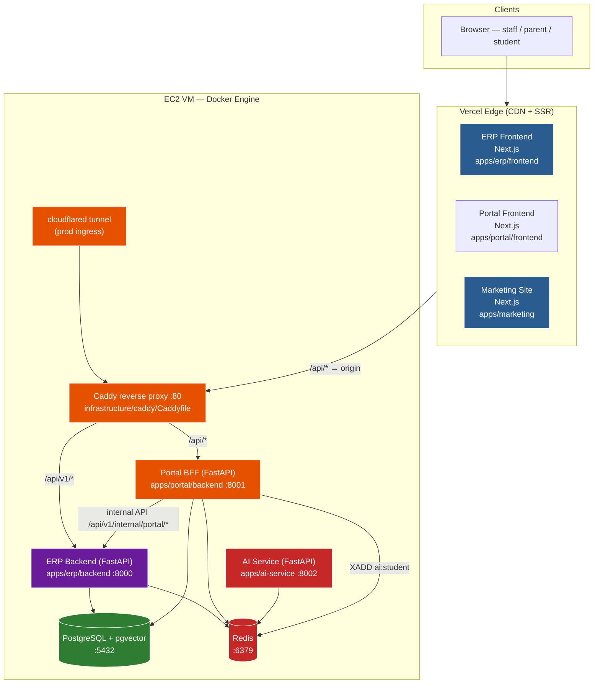
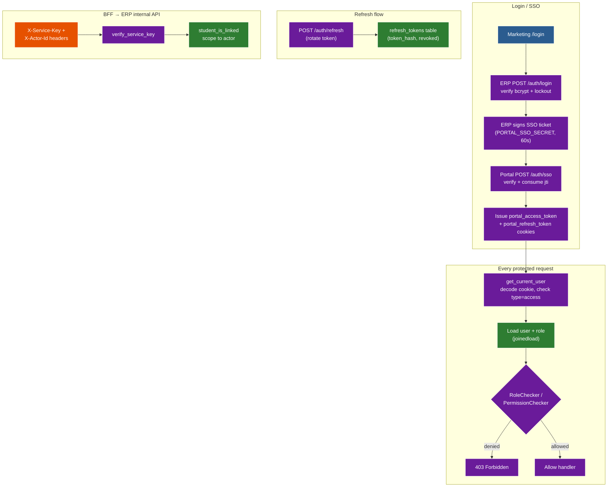

# SYSTEM DESIGN & ARCHITECTURE LEARNING GUIDE
## Al-Dirasat Learning Institution Management System (LIMS)

> **Who this is for:** you built this system with AI assistance and now need to
> master every architectural concept, file, and infrastructure decision from
> first principles — well enough to explain it to a senior engineer.
>
> **How to read it:** every major concept follows the same **six-stage** teaching
> rhythm:
>
> 1. **Theoretical Concept** — what it is in computer science, from scratch, with a
>    non-software analogy.
> 2. **The Problem & "Why"** — what it solves, and what breaks at scale without it.
> 3. **Tool Landscape** — the industry tools that exist for this job, compared.
> 4. **Deep-Dive on Our Chosen Tool** — how the tool we picked works *under the hood*.
> 5. **Project Implementation** — exact file paths + a line-by-line code walkthrough.
> 6. **Trade-offs & Alternatives** — a table covering *Complexity, Scalability,
>    Cost, and Failure Modes*.

---

## Table of Contents

1. [Module 0 — The Whole System in One Picture](#module-0--the-whole-system-in-one-picture)
2. [Module 1 — Reverse Proxy & Ingress (Caddy)](#module-1--reverse-proxy--ingress-caddy)
3. [Module 2 — Container Platform & Networking (Docker Compose)](#module-2--container-platform--networking-docker-compose)
4. [Module 3 — The BFF / Gateway Pattern (Portal Backend)](#module-3--the-bff--gateway-pattern-portal-backend)
5. [Module 4 — Caching (Redis Read-Through)](#module-4--caching-redis-read-through)
6. [Module 5 — Async Message Queues (Redis Streams)](#module-5--async-message-queues-redis-streams)
7. [Module 6 — Database Indexing & Migrations (PostgreSQL + Alembic)](#module-6--database-indexing--migrations-postgresql--alembic)
8. [Module 7 — Authentication & Authorization (JWT + RBAC + SSO)](#module-7--authentication--authorization-jwt--rbac--sso)
9. [Module 8 — Realtime (SSE over Redis Pub/Sub)](#module-8--realtime-sse-over-redis-pubsub)
10. [Module 9 — Idempotency](#module-9--idempotency)
11. [Module 10 — File Storage & Uploads](#module-10--file-storage--uploads)
12. [Module 11 — Background & Scheduled Jobs](#module-11--background--scheduled-jobs)
13. [Module 12 — Frontend Architecture (Next.js + Middleware)](#module-12--frontend-architecture-nextjs--middleware)
14. [Appendix A — Complete File Map](#appendix-a--complete-file-map)
15. [Appendix B — Environment Variable Reference](#appendix-b--environment-variable-reference)
16. [Appendix C — Every Tool, Library & Service](#appendix-c--every-tool-library--service)

---

## Module 0 — The Whole System in One Picture

Before any single concept, internalize the shape: **three Next.js frontends on
Vercel, one reverse proxy + four Python containers on a single VM, and two
stateful stores (PostgreSQL and Redis) shared by everything.**



**Three facts to memorize:**

1. **The browser never talks to the VM directly.** It hits Vercel, which rewrites
   `/api/*` to the origin (`apps/portal/frontend/next.config.js`). The VM exposes
   only port 80, owned by Caddy.
2. **Two API surfaces.** `/api/v1/*` → ERP backend; `/api/*` → portal BFF. Caddy
   does path-based routing so one origin serves two products
   (`infrastructure/caddy/Caddyfile`).
3. **Two stateful stores, three consumers.** Postgres is owned by the ERP (the BFF
   reads only its `portal.*` tables directly). Redis is one shared instance used
   three ways: realtime pub/sub, AI job queues, and a read-through cache.

---

## Module 1 — Reverse Proxy & Ingress (Caddy)

### 1. Theoretical Concept
A **reverse proxy** is a server that sits *in front of* one or more backend
services and forwards client requests to them, then returns the responses as if
they were its own. "Reverse" because it proxies *for the server*, unlike a forward
proxy which acts *for the client* (a corporate firewall that hides your identity
outbound).

**Analogy:** the receptionist at the front desk of an office building. Visitors
never walk into a specific office; they tell the receptionist where they want to
go, and the receptionist routes them, checks their ID, applies building rules, and
returns whatever comes back. Every office stays behind one public door.

### 2. The Problem & "Why"
Without a reverse proxy, every backend would need its own public IP and port, every
client would hard-code which server handles what, and concerns like TLS, security
headers, request-size limits, and gzip would be duplicated in every service. At
scale this breaks in specific ways:

- **Cookie/CORS fragmentation** — two backends on two origins means two CORS
  configs and cookies that don't cross subdomains.
- **No single choke point** — you can't rate-limit, block, or compress at one place.
- **Realtime breaks behind buffering** — a naive proxy that buffers responses will
  swallow Server-Sent Events until the connection closes.

### 3. Tool Landscape

| Tool | Type | Strengths | Weaknesses |
|---|---|---|---|
| **Nginx** | C/web server | Battle-tested, huge ecosystem, Lua scripting | Manual TLS, verbose config |
| **Caddy** | Go/reverse proxy | Auto-HTTPS, one readable file, built-in streaming | Younger ecosystem |
| **Traefik** | Go/edge router | Dynamic service discovery (K8s/Docker labels) | Needs a service registry to shine |
| **HAProxy** | C/LB | Extreme L4/L7 performance | Steeper config, no auto-TLS |
| **Envoy** | C++/sidecar | Service-mesh data plane, xDS | Overkill for a static topology |
| **Cloud LB** (ALB) | Managed | Zero-ops, integrates with cloud | Vendor lock-in, cost |

### 4. Deep-Dive on Our Chosen Tool — Caddy
Caddy is a single Go binary. Three things make it special:

- **Automatic HTTPS** — Caddy implements the ACME protocol (Let's Encrypt) and
  obtains/renews TLS certificates with zero config. Go's `crypto/tls` does the
  handshake; Caddy manages cert lifecycle.
- **Declarative config** — a `Caddyfile` compiles to a JSON config consumed by
  Caddy's HTTP server. `handle` blocks are *mutually exclusive* matchers evaluated
  most-specific-first; `reverse_proxy` is a handler that streams the upstream
  response.
- **Streaming by design** — `reverse_proxy` flushes response bytes as they arrive;
  `flush_interval -1` disables buffering entirely, which is what makes SSE work.

### 5. Project Implementation
`infrastructure/caddy/Caddyfile` is the routing table:

```caddy
handle /api/v1/events/stream { reverse_proxy {env.BACKEND_URL} { flush_interval -1 } }
handle /uploads/*           { encode gzip; reverse_proxy {env.BACKEND_URL} }
handle /api/v1/*            { encode gzip; reverse_proxy {env.BACKEND_URL} }
handle /api/*               { encode gzip; reverse_proxy {env.PORTAL_BACKEND_URL} }
import security_headers
```

**Line-by-line:**

1. `handle /api/v1/events/stream` — the SSE route is declared *first* because
   `handle` blocks are mutually exclusive and more-specific paths must win over the
   `/api/v1/*` catch-all. `flush_interval -1` disables buffering so realtime frames
   flush immediately (`Caddyfile:28-32`).
2. `handle /uploads/*` → ERP backend; `encode gzip` compresses the body.
3. `handle /api/v1/*` → ERP backend (`{env.BACKEND_URL}` = `backend:8000`).
4. `handle /api/*` → portal BFF (`{env.PORTAL_BACKEND_URL}` = `portal-backend:8001`).
5. `import security_headers` applies the shared `security_headers` snippet — CSP,
   `X-Content-Type-Options`, `X-Frame-Options: DENY`, HSTS (`Caddyfile:2-12`).

Caddy is the *sole* ingress: `docker-compose.yml:149-150` publishes only `80:80`,
and `docker-compose.portal.yml:10` gives the portal/AI containers **no host ports**.
The `cloudflared` tunnel (`docker-compose.yml:175-186`) is the encrypted production
path into Caddy, so the VM needs no open firewall port.

### 6. Trade-offs & Alternatives

| Dimension | **Our Choice: Caddy** | Alternative A: Nginx | Alternative B: Traefik/Envoy |
|---|---|---|---|
| Complexity | Lowest — one readable file | Medium — verbose `nginx.conf` | Higher — service-discovery model |
| Scalability | High (Go, event-driven) | High | High |
| Cost | Free + auto-HTTPS | Free | Free (but ops overhead) |
| Failure Modes | Newer tool, smaller community | Manual cert expiry is a classic outage | Misconfig with service discovery is hard to debug |

**Why not the alternatives:** Nginx does the same job but needs manual TLS
certificates (a cert-expiry outage is the exact failure mode we'd rather not own)
and a more cryptic config. Traefik/Envoy shine with dynamic service discovery; our
topology is static, so their moving parts add risk without benefit.

---

## Module 2 — Container Platform & Networking (Docker Compose)

### 1. Theoretical Concept
**Containers** package an app with its exact runtime (OS libs, interpreter,
dependencies) into an immutable image that runs identically anywhere. **Docker
Compose** is a declarative manifest that says which containers exist, how they are
networked, where their durable data lives, and their resource limits.

**Analogy:** shipping containers on a cargo ship. Each container is self-contained
and stackable; the **manifest** (Compose file) is what tells the crane where each
one goes and which pipes and power lines to hook up.

### 2. The Problem & "Why"
Running an app directly on a VM means "works on my machine" drift, dependency
conflicts, and no clean way to restart or scale pieces. Without containerization:

- A missing system lib (e.g., `libpq`) breaks a deploy that worked locally.
- A restart forgets environment variables or data lives in an ephemeral path.
- Startup order is hand-managed — the API might boot before the DB is ready.

### 3. Tool Landscape

| Tool | Type | Strengths | Weaknesses |
|---|---|---|---|
| **Docker Compose** | Single-host orchestrator | One `up -d`, readable YAML, volumes | No multi-node |
| **Kubernetes** | Multi-node orchestrator | Horizontal scaling, self-healing | Steep ops burden, control-plane cost |
| **Nomad** | Multi-node scheduler | Simpler than K8s, batch + services | Smaller ecosystem |
| **Podman + systemd** | Daemonless containers | Rootless, integrates with systemd | Less tooling |
| **Managed PaaS** (Render/Fly) | Vendor abstraction | Zero-ops | Lock-in, less control |

### 4. Deep-Dive on Our Chosen Tool — Docker Networking
Under the hood, Docker creates a **bridge network** (`lims-internal`): a virtual
switch using Linux network namespaces + `veth` pairs + iptables NAT. Every
container gets an IP on that subnet, and Docker runs an **embedded DNS server**
(`127.0.0.11`) so a container can resolve another container *by service name* —
that's why `DATABASE_URL` can say `@database:5432` with no IP.

- **Volumes** (named) are the durable filesystem; **bind mounts** map a host path
  (e.g., the `Caddyfile`) into the container.
- **Healthchecks** are commands Docker runs periodically; `depends_on:
  condition: service_healthy` blocks startup until the dependency passes.

### 5. Project Implementation
Two compose files, one shared network (`docker-compose.yml:17-20` declares
`lims-internal`):

- `docker-compose.yml` owns `database`, `redis`, `backend`, `caddy`, `cloudflared`.
- `docker-compose.portal.yml` joins that network via `external: true` (line 13) and
  declares `portal-backend` + `ai-service`.

Key decisions in `docker-compose.yml`:

1. **Single shared Redis** (lines 55-101) — ERP, BFF, and ai-service all connect to
   `lims_redis:6379`. The header comment (lines 11-15) warns a *second* `redis`
   service would collide on the network alias.
2. **`DATABASE_URL`** points at the `database` service name (line 113) — resolved by
   embedded DNS, never a hard-coded IP.
3. **Healthchecks + `depends_on`** — `pg_isready` for Postgres, `curl /health` for
   the backend (lines 125-138).
4. **Volumes** — `uploads_data`, `backups`, `pgdata`, `redis_data`, `caddy_data`
   persist state (lines 128-130, 188-194).
5. **Resource limits** — `deploy.resources` caps CPU/memory per service.

### 6. Trade-offs & Alternatives

| Dimension | **Our Choice: Docker Compose** | Alternative A: Kubernetes | Alternative B: Managed PaaS |
|---|---|---|---|
| Complexity | Low | Very high | Lowest |
| Scalability | Single VM (vertical) | Horizontal, multi-node | Elastic, vendor-managed |
| Cost | ~$5-20/mo VM | Cluster control-plane overhead | Higher per-request |
| Failure Modes | Single point of failure (the VM) | Misconfigured scheduling/CRDs | Provider outage / lock-in |

**Why not the alternatives:** Kubernetes solves multi-node orchestration we don't
need at a single-institution scale, and its failure modes (scheduling, CRDs,
networking policies) are far more numerous than "the VM is down." A PaaS abstracts
away the one thing we *want* control over — running Postgres/Redis/Caddy as peers,
`pg_dump` backups, and the tunnel.

---

## Module 3 — The BFF / Gateway Pattern (Portal Backend)

### 1. Theoretical Concept
A **Backend-for-Frontend (BFF)** is a dedicated server-side component that exists
to serve *one specific client*. It translates that client's needs into calls to
upstream services, aggregates the results, and returns a payload shaped exactly for
that client — while owning that client's authentication.

**Analogy:** a personal assistant who works for one executive. The executive never
calls twelve departments; they call the assistant, who knows their calendar,
fetches only what's needed, and hands back one tidy summary.

### 2. The Problem & "Why"
Exposing a monolithic ERP directly to untrusted external users (parents/students)
is dangerous and slow: the ERP's staff API exposes far more than a parent should
see, its payloads are staff-shaped, and its auth is staff-shaped. Without a BFF:

- The public client would need staff-grade credentials or a sprawling permission
  matrix.
- The portal would issue a dozen round-trips to assemble one dashboard.
- Token lifetimes and scaling would be coupled to the ERP.

### 3. Tool Landscape

| Tool | Type | Strengths | Weaknesses |
|---|---|---|---|
| **Dedicated BFF** | Thin per-client API | Tailored shape, isolated auth, aggregation | One more service |
| **GraphQL gateway** | Schema-first API | Client picks fields, one query | Resolver N+1 risk, steep |
| **API gateway** (Kong/Apigee) | Centralized proxy | Auth/rate-limit/transform in one place | Heavyweight, vendor-ish |
| **Direct public API** | Just expose the ERP | Simplest | Unsafe, coupled |

### 4. Deep-Dive on Our Chosen Tool — A Thin, Stateless BFF
Our BFF is a **thin** layer, not a fat one. It has two jobs only:

1. **Own portal auth** — sign/validate its own JWTs with `PORTAL_JWT_SECRET`
   (never the ERP's secret).
2. **Proxy + scope reads/writes** to the ERP via a *service-to-service* contract,
   carrying two headers: `X-Service-Key` (proves "I am the BFF") and `X-Actor-Id`
   (the portal user whose permissions scope the data).

The clever part is **actor scoping**: the BFF never trusts itself to filter data. It
forwards the actor id, and the ERP re-verifies the actor → student link on every
call, so even a compromised BFF cannot read a student it isn't linked to.

### 5. Project Implementation
`apps/portal/backend/app/services/erp_client.py` is the typed client:

```python
async def _request(self, method, path, actor_id, params=None, json=None, files=None):
    if not self._service_key:
        raise ErpClientError(500, "ERP_SERVICE_KEY not configured in portal backend")
    headers = {"X-Service-Key": self._service_key, "X-Actor-Id": actor_id, "Accept": "application/json"}
    async with httpx.AsyncClient(timeout=30.0) as client:
        resp = await client.request(method, f"{self._base_url}{_INTERNAL_PREFIX}{path}", headers=headers, ...)
```

**Line-by-line:**

1. `_request` refuses to run without `ERP_SERVICE_KEY` (`erp_client.py:44-45`).
2. It sets `X-Service-Key` + `X-Actor-Id` on every call (lines 46-50).
3. It issues the request to `{ERP_INTERNAL_URL}/api/v1/internal/portal{path}`.
4. On `>=400` it raises a typed `ErpClientError` carrying the status + detail
   (lines 60-68).

On the ERP side, `apps/erp/backend/app/modules/portal_internal/dependencies.py:11-33`
validates the key, and `router.py:70-76` runs `_verify_student_access` before every
student-scoped read — checking `portal.student_links` / `portal.parent_links`.

### 6. Trade-offs & Alternatives

| Dimension | **Our Choice: Dedicated BFF** | Alternative A: Direct-to-ERP API | Alternative B: GraphQL gateway |
|---|---|---|---|
| Complexity | Medium — one more service | Low | High |
| Scalability | Independent per-client scaling | Coupled to ERP | Good, resolver N+1 risk |
| Cost | One small container | Lowest | Medium |
| Failure Modes | Extra hop + ERP downtime = 502 | Over-exposure of staff APIs | N+1 query storms, schema drift |

**Why not the alternatives:** direct exposure would force the portal to hold
staff-grade credentials or a sprawling permission matrix. GraphQL adds a query
language and resolver complexity for a fixed set of ~7 dashboard resources that
plain REST already serves cleanly.

---

## Module 4 — Caching (Redis Read-Through)

### 1. Theoretical Concept
A **cache** is a smaller, faster store that holds a copy of frequently-read data so
the slow source of truth isn't hit every time. **Read-through** is a specific
strategy: the application asks the cache first; on a miss it reads the source,
populates the cache, and returns the value — so the next read hits.

**Analogy:** a librarian who keeps the most-requested books on the front desk. You
ask; they check the desk first (**hit**); if absent, they walk to the stacks
(**source of truth**), fetch it, and leave a copy on the desk (**populate**) for the
next person.

### 2. The Problem & "Why"
Databases are the slowest, most expensive tier. An LMS's read path is a funnel:
hundreds of parents poll the same grades/attendance for the same students. Without
a cache, every one of those reads becomes a multi-table join against Postgres —
which at peak turns a "parent refresh storm" into a database load test and a
latency spike for *everyone*, staff included.

### 3. Tool Landscape

| Tool | Type | Strengths | Weaknesses |
|---|---|---|---|
| **In-memory dict** | Process-local | Zero latency, zero deps | Lost on restart, per-instance |
| **Memcached** | Distributed cache | Simple, fast, multi-threaded | No persistence, strings only |
| **Redis** | In-memory data store | Rich types, persistence, pub/sub | Single-threaded (blocking ops) |
| **Varnish** | HTTP reverse cache | Caches full responses, edge | HTTP-only, not app-level |
| **CDN edge** (Cloudflare) | Edge cache | Massive distribution | Can't cache per-user safely |

### 4. Deep-Dive on Our Chosen Tool — Redis
Redis is an **in-memory data structure server** with a **single-threaded event
loop** (network I/O + command execution are serialized, which is why it's
blazing-fast and atomic). Under the hood:

- **Keys/values** are stored in a global hash table (`dict`) with two hash tables
  and incremental rehashing for resizing without stalls.
- **Strings** use *SDS* (simple dynamic strings); **lists** use linked lists/
  listpacks; **sorted sets** use a **skip list + hash**; **streams** use a radix
  tree (`rax`) of macro-nodes + listpacks of entries.
- **Expiration** is lazy + active: a key is checked on access, and a background
  loop samples ~20 random keys 10×/sec to expire the overdue ones.
- **Eviction** (`volatile-lru`) approximates LRU by sampling keys *with* a TTL —
  exactly the ones our cache sets with `ex=60` — while never touching the no-TTL
  `ai:*` streams.
- **Persistence**: RDB snapshots (fork + copy-on-write) and AOF (append-only file
  with `appendfsync everysec`).

### 5. Project Implementation
`apps/portal/backend/app/services/cache.py` implements the read-through:

```python
def cache_key(resource, student_id, params=None):
    raw = json.dumps(params or {}, sort_keys=True, default=str)
    digest = hashlib.sha256(raw.encode()).hexdigest()[:16]
    return f"{CACHE_PREFIX}:{resource}:{student_id}:{digest}"
```

**Line-by-line:**

1. `cache_key` (lines 48-51) builds a deterministic key `cache:{resource}:{student_id}:{sha256(params)[:16]}`.
2. `_read_cached` in `portal/router.py:29-66` checks the cache; on hit it sets
   `X-Cache: HIT` and returns the stored payload (lines 48-53).
3. On miss it calls `fetch()` (a proxied ERP read), stores the result with
   `ex=60`, and sets `X-Cache: MISS` (lines 56-66).
4. `?refresh=1` forces a miss, so a parent's "refresh now" button sees fresh data
   (lines 44-47).
5. `CacheClient.get/set/delete` degrade gracefully — any Redis error falls through
   to a live ERP read (`cache.py:80-110`).
6. **Invalidation is portal-owned**: after a proxied write succeeds, the BFF deletes
   the affected keys (`portal/router.py:229-232`).

Redis eviction is `volatile-lru` (`docker-compose.yml:72`) so only TTL'd cache keys
are evicted, never the `ai:*` job streams.

### 6. Trade-offs & Alternatives

| Dimension | **Our Choice: Redis read-through** | Alternative A: CDN/HTTP cache | Alternative B: In-process cache |
|---|---|---|---|
| Complexity | Medium | Low | Low |
| Scalability | Shared across replicas | Edge-distributed | Per-instance only |
| Cost | One Redis (already shared) | Edge egress cost | Free |
| Failure Modes | Stale data if invalidation missed; Redis down = cache miss storm | Serving wrong user's data if miskeyed | Stale across pods; lost on restart |

**Why not the alternatives:** a CDN caches full HTTP responses, but these payloads
are *per authenticated user* — a CDN would serve parent A's grades to parent B
unless keyed by cookies (fragile). An in-process cache is per-container and would
be inconsistent the moment the BFF scales past one replica.

---

## Module 5 — Async Message Queues (Redis Streams)

### 1. Theoretical Concept
A **message queue** decouples a *producer* (who says "this work needs doing") from
a *consumer* (who does it later). The producer writes a job to the queue and moves
on; the consumer pulls jobs and acknowledges completion. This gives you
*asynchrony*, *buffering*, and *durability*.

**Analogy:** a restaurant's order rail. Waiters (**producers**) pin tickets to the
rail without waiting for the kitchen; cooks (**consumers**) pull tickets one at a
time and shout "done" so the ticket is removed. If a cook collapses, the ticket is
still on the rail to be picked up again.

### 2. The Problem & "Why"
AI explanation and content ingestion can take *seconds to minutes* (LLM calls,
embedding generation). You must never make a user's HTTP request wait on that —
the request would time out at Vercel/Caddy, and a retry would re-run the job.
Without a queue, long-running work either blocks the request thread or is lost on
crash — and a lost job means a parent never gets their explanation.

### 3. Tool Landscape

| Tool | Type | Strengths | Weaknesses |
|---|---|---|---|
| **Redis Streams** | Log + consumer groups | Reuses Redis, consumer groups, PEL | Not a full broker (no routing) |
| **RabbitMQ** | AMQP broker | Exchanges/routing, acks, mature | Second broker to operate |
| **Kafka** | Distributed log | Massive throughput, replay, partitions | Heavy ops, overkill here |
| **SQS** | Managed queue | Zero-ops, auto-scale | Per-message cost, AWS lock-in |
| **Celery** | Task framework | Batteries-included (retries, beat) | Hides transport, pins API |

### 4. Deep-Dive on Our Chosen Tool — Redis Streams
A **stream** is an append-only log of entries (id + field/value map). On top of it:

- **Consumer groups** let multiple workers share the load: `XREADGROUP` with `>`
  hands each new entry to exactly one worker.
- **No auto-ACK** means a claimed entry goes into a **Pending Entries List (PEL)**
  until `XACK` confirms it — if the worker dies, the entry stays pending and is
  re-delivered after a visibility timeout (via `XAUTOCLAIM`).
- **Dead-letter queue (DLQ)** is just *another stream*: after `MAX_ATTEMPTS`, the
  job is `XADD`ed to `ai:dlq` instead of being re-delivered forever.

### 5. Project Implementation
`app/core/queue.py` (ERP) and its mirror `portal/backend/app/services/queue.py`
implement a transport-agnostic `Queue` protocol:

```python
class RedisStreamsQueue:
    async def enqueue(self, queue, payload):
        job_id = str(uuid.uuid4())
        entry = {"job_id": job_id, "payload": json.dumps(payload), "attempts": "0", "last_error": ""}
        await self._redis.xadd(queue, entry)
        return job_id
```

**Line-by-line:**

1. `enqueue` (lines 66-75) `XADD`s an entry with `job_id`, `payload`, and
   `attempts: 0`, returning `job_id` to the caller as a 202.
2. `dequeue` (lines 77-105) calls `xreadgroup(GROUP_NAME, "worker", {queue: ">"}, ...)`
   — the `>` means "only new entries" — and returns the parsed entry.
3. `ack` (lines 107-108) `XACK`s the message id off the PEL.
4. Un-acked entries stay pending; after the 30s `_visibility_timeout` they're
   re-delivered with `attempts` incremented; at `MAX_ATTEMPTS = 3` they go to
   `ai:dlq` (`queue.py:1-13`).

Two streams: `ai:student` (HIGH, user-facing) and `ai:ingestion` (LOW, background).
The portal enqueues to `ai:student` via `ai_proxy/router.py:15-42`.

### 6. Trade-offs & Alternatives

| Dimension | **Our Choice: Redis Streams** | Alternative A: RabbitMQ | Alternative B: Celery + Redis |
|---|---|---|---|
| Complexity | Medium | High (broker + exchanges) | Medium |
| Scalability | Good (consumer groups) | Excellent | Good |
| Cost | Free (shared Redis) | Free | Free |
| Failure Modes | Redis is single point; stream grows if no consumer | Broker config drift | Hidden retry/serialization surprises |

**Why not the alternatives:** RabbitMQ adds a second broker to operate and reason
about. Celery bundles scheduling/retries but hides the transport and pins us to its
API. Redis Streams reuse the Redis we *already run* for pub/sub and cache — one
dependency, three jobs.

---

## Module 6 — Database Indexing & Migrations (PostgreSQL + Alembic)

### 1. Theoretical Concept
A **relational database** stores data in tables with enforced relationships
(foreign keys). An **index** is a separate sorted structure that makes lookups
O(log n) instead of a full table scan. A **migration** is a versioned, ordered
script that transforms the schema from one state to the next.

**Analogy:** a well-organized filing cabinet. **Foreign keys** are the "see also"
tabs between drawers; **indexes** are the alphabetical tabs that let you jump
straight to a name; **migrations** are the building's renovation log that records
exactly how the filing system changed over time, so any state can be reproduced.

### 2. The Problem & "Why"
An LMS's data is deeply relational — a student *enrolls in* a section *of* a
course, *pays* via payments, *earns* grades, and *receives* a certificate. Without
indexes, every `WHERE student_id = ?` becomes a full table scan (O(n)) that slows
linearly as students accumulate. Without migrations, schema changes are
hand-applied and unrepeatable — the exact failure mode where prod and dev drift
apart, or a deploy crashes because a column is missing.

### 3. Tool Landscape

| Tool | Type | Strengths | Weaknesses |
|---|---|---|---|
| **PostgreSQL** | Relational DB | ACID, JSONB, pgvector, MVCC | Connection-per-client model |
| **MySQL/MariaDB** | Relational DB | Very good, widely hosted | Weaker JSONB/MVCC defaults |
| **SQLite** | Embedded DB | Zero-ops | Single-writer, not for multi-user |
| **MongoDB** | Document DB | Flexible schema | Joins/transactions are weak |
| **Flyway** (migrations) | Versioned SQL | Plain SQL, DB-agnostic | Less ORM-aware |
| **Alembic** (migrations) | Python/ORM-aware | Autogenerate from models, reversible | Python-specific |

### 4. Deep-Dive on Our Chosen Tool — Postgres + Alembic
- **B-tree indexes** are balanced trees; Postgres walks ~3-4 levels even for
  millions of rows, giving O(log n) lookups. We use *unique* indexes (enforce
  `receipt_number` uniqueness), *composite* indexes (certificate `section_id +
  issued_at`), and *partial* indexes (`WHERE deleted_at IS NULL`).
- **MVCC (Multi-Version Concurrency Control)** means readers never block writers:
  each row version carries visibility metadata (`xmin`/`xmax`), so a `SELECT` sees
  a consistent snapshot while `INSERT`/`UPDATE` proceed. That's why the health page
  can query locks/transactions without disturbing traffic.
- **Alembic** keeps a `revision` chain; `alembic upgrade head` walks it forward,
  and `--autogenerate` diffs the ORM `metadata` against the live DB to write the
  next revision. The global **naming convention** in `db/base.py` gives every
  constraint a deterministic name so autogenerate can tell "same" from "changed."

### 5. Project Implementation
`apps/erp/backend/app/db/base.py`:

```python
naming_convention = {
    "ix": "ix_%(column_0_label)s", "uq": "uq_%(table_name)s_%(column_0_name)s",
    "fk": "fk_%(table_name)s_%(column_0_name)s_%(referred_table_name)s",
    "pk": "pk_%(table_name)s",
}
```

**Walkthrough of a migration from code to schema:**

1. A model changes in `app/modules/academic/models.py` (e.g., a new column or a
   `UniqueConstraint` like `academic/models.py:18-20`).
2. `alembic revision --autogenerate` compares metadata to the live DB and writes a
   file in `alembic/versions/` (51 migrations exist as of writing).
3. On container start, `docker-entrypoint.sh:8` runs `alembic upgrade head` *before*
   uvicorn starts, so the schema is always current.
4. The health page's `probe_migrations` (`sysmetrics/service.py:257-313`) compares
   `alembic_version` against `script.get_heads()` and reports `in_sync` / `behind` /
   `missing_revision`.

**Soft delete** is a deliberate pattern: `deleted_at` columns on courses, sections,
students, and enrollments mean history survives a withdrawal — queries filter
`deleted_at IS NULL` (e.g., `portal_internal/service.py:25-27`).

### 6. Trade-offs & Alternatives

| Dimension | **Our Choice: PostgreSQL** | Alternative A: MySQL | Alternative B: MongoDB |
|---|---|---|---|
| Complexity | Medium | Medium | Low to start, high later |
| Scalability | Excellent (replicas, partitioning) | Very good | Good (sharding) |
| Cost | Free/open-source | Free/open-source | Free/open-source |
| Failure Modes | Connection exhaustion without pooling | Subtle collation/engine differences | Joins/transactions done in app code |

**Why not the alternatives:** the domain is fundamentally relational (money,
enrollments, roles) — Postgres is the best at that. MongoDB would force us to
reimplement joins and transactions in application code. pgvector is the deciding
tiebreaker: vector search *in the same database* rather than a separate vector store.

---

## Module 7 — Authentication & Authorization (JWT + RBAC + SSO)

### 1. Theoretical Concept
**Authentication** verifies *who* you are; **authorization** decides *what* you may
do. A **JWT (JSON Web Token)** is a signed, tamper-evident token: three base64url
parts — header, payload (claims), signature — where the signature can only be
reproduced by someone holding the secret key. **RBAC (Role-Based Access Control)**
maps a user → roles → permissions.

**Analogy:** a signed ID badge. The security desk can verify the badge was issued
by the building *without calling the issuer*, because the signature can't be forged
without the building's stamp. Which doors the badge opens is **authorization**.

### 2. The Problem & "Why"
An LMS has two hard security needs: (1) *role separation* — a teacher must never
reach the payments page, a parent must never see another student's grades; and
(2) *stateless scale* — the API must validate a request without a server-side
session store, because the VM may restart between requests. Without this, a session
store + sticky routing would be required, and a single leaked staff session could
compromise every student.

### 3. Tool Landscape

| Tool | Type | Strengths | Weaknesses |
|---|---|---|---|
| **Server-side sessions** | Stateful | Simple, revocable | Needs a store + sticky routing |
| **JWT (HS256/RS256)** | Stateless | No store, self-contained | Can't revoke single token easily |
| **OAuth2/OIDC** | Delegation | Standard, third-party login | Heavy, external dependency |
| **PASETO** | Modern token | Stronger defaults than JWT | Smaller ecosystem |
| **SAML** | Enterprise SSO | Corporate federation | XML-heavy, complex |

### 4. Deep-Dive on Our Chosen Tool — JWT + bcrypt + RBAC
- **HS256** = HMAC-SHA256, a *symmetric* signature: one secret both signs and
  verifies. (RS256 would use a private/public key pair — asymmetric.)
- **Claims** carry the security context: `sub` (subject/user id), `exp` (expiry),
  `iat` (issued-at), `jti` (unique id for revocation), and a custom `type`
  (`access` vs `refresh`).
- **bcrypt** is a deliberately *slow* key-derivation function (Blowfish-based,
  adaptive cost factor 12 here): a salt is embedded, and the slowness makes offline
  brute-force attacks expensive.
- **Refresh rotation** means every refresh revokes the old token and issues a new
  one — a leaked refresh token is single-use and quickly detected.

### 5. Project Implementation
Three **distinct signing secrets** (`app/core/config.py:59-77`, portal
`core/config.py:18-35`):

| Secret | Signs | Lifetime | Audience |
|---|---|---|---|
| `JWT_SECRET_KEY` | ERP staff access/refresh | 15 min / 7 days | staff |
| `PORTAL_JWT_SECRET` | Portal access/refresh | 10 min / 30 days | parents/students |
| `PORTAL_SSO_SECRET` | one-time SSO ticket | 60 s | ERP → portal |

**Auth pipeline:**



**Line-by-line (protected request):**

1. `get_current_user` reads the `access_token` cookie and calls `decode_token`,
   rejecting if `type != "access"` (`identity/dependencies.py:22-44`).
2. It loads the user + role + employee in one `select` with `joinedload`
   (`dependencies.py:46`), returning 401 if deactivated.
3. `require_manager` (a `RoleChecker` subclass) checks the role, allowing
   `superadmin` through and 403-ing others (`dependencies.py:83-99`).
4. `PermissionChecker` enforces DB-backed page permissions via the
   `role_permissions` join table (`dependencies.py:102-128`).

**SSO ticket flow** (`identity/security.py:64-87`, portal `auth/router.py:107-135`):
the ERP signs `{sub, aud: "portal", type: "sso", jti, exp: +60s}` with
`PORTAL_SSO_SECRET`; the portal verifies it and marks it consumed via
`INSERT ... ON CONFLICT (jti) DO NOTHING` — making replay impossible
(`auth/service.py:155-168`).

### 6. Trade-offs & Alternatives

| Dimension | **Our Choice: JWT in HttpOnly cookie** | Alternative A: Server-side sessions | Alternative B: OAuth2/OIDC |
|---|---|---|---|
| Complexity | Medium | Low | High |
| Scalability | Stateless — no session store | Needs store + sticky routing | External dependency |
| Cost | Free | Free (+ session store) | Provider cost |
| Failure Modes | Token theft until expiry (mitigated by rotation) | Session store outage = all logins fail | Provider outage blocks login |

**Why not the alternatives:** server-side sessions reintroduce state and sticky
routing, undoing the stateless benefit. A full OIDC provider (Keycloak/Auth0) is
"correct" at enterprise scale but adds a runtime dependency to every login for a
single institute.

---

## Module 8 — Realtime (SSE over Redis Pub/Sub)

### 1. Theoretical Concept
**Server-Sent Events (SSE)** is a one-way push channel over plain HTTP: the server
holds a long-lived connection and streams `text/event-stream` frames as they happen.
**Redis Pub/Sub** is an internal message bus: publishers `PUBLISH` to a *channel*,
and every current `SUBSCRIBER` receives it — but there is no persistence (a message
with no listener is simply gone).

**Analogy:** a one-way radio broadcast. The station (server) holds the frequency
(connection) open and broadcasts bulletins; Redis Pub/Sub is the internal
switchboard that patches the broadcast to every radio tuned to that station *right
now*.

### 2. The Problem & "Why"
An LMS needs parents/staff to see "a payment was recorded" or "a grade was posted"
without clicking refresh. Without a push channel, users must poll every few
seconds — multiplying load on the BFF and DB. SSE gives push over plain HTTP that
survives proxies and reuses the existing cookie auth, so there's no second
credential to manage.

### 3. Tool Landscape

| Tool | Type | Strengths | Weaknesses |
|---|---|---|---|
| **SSE** | HTTP one-way | EventSource built-in, proxy-friendly | Server→client only |
| **WebSockets** | Bidirectional | Full duplex | More code, sticky connections |
| **Long-polling** | HTTP request/response | Works everywhere | Request storm, wasteful |
| **WebRTC** | Peer-to-peer | Lowest latency | Complexity, NAT traversal |

### 4. Deep-Dive on Our Chosen Tool — SSE + Redis Pub/Sub
- **SSE framing**: `id:`, `event:`, `data:`, plus `:` comment lines (heartbeats)
  and `retry:` (reconnect policy). The `event:` field makes one connection
  *multiplexable* — the browser routes each frame to its `addEventListener(type)`.
- **Redis pub/sub** holds **one dedicated TCP connection** per subscriber (not
  pooled/multiplexed), which is why `subscribe()` must close its `pubsub` in a
  `finally` — a leaked connection accumulates fast (`bus.py:11-17`).

### 5. Project Implementation
`apps/erp/backend/app/modules/events/`:

```python
class RedisEventBus:
    async def publish(self, channel, event):
        await _get_redis().publish(channel, json.dumps(event, default=str))

    async def subscribe(self, channel, timeout=20.0):
        pubsub = _get_redis().pubsub()
        await pubsub.subscribe(channel)
        try:
            while True:
                message = await pubsub.get_message(ignore_subscribe_messages=True, timeout=timeout)
                if message is None: yield HEARTBEAT; continue
                yield json.loads(message["data"])
        finally:
            await pubsub.unsubscribe(channel); await pubsub.aclose()
```

**Line-by-line:**

1. `publish` (lines 101-102) `PUBLISH`es a JSON event to `events:user:{user_id}`.
2. `subscribe` (lines 104-131) subscribes, then polls `get_message` with a timeout
   so control returns to the caller on idle (to emit a heartbeat).
3. `finally` (lines 128-131) unsubscribes and closes the dedicated connection.
4. `events/router.py:77-101` wraps this in a `StreamingResponse` with
   `text/event-stream`, heartbeats, and a `retry: 1000` reconnect hint.
5. `envelope.py:40-49` renders each envelope as `id:/event:/data:` frames.

The transport is **pub/sub, not the job queue**, because events are *hints* whose
loss is harmless — the client re-fetches on reconnect (`bus.py:7-17`).

### 6. Trade-offs & Alternatives

| Dimension | **Our Choice: SSE** | Alternative A: WebSockets | Alternative B: Long-polling |
|---|---|---|---|
| Complexity | Low | Medium (bidirectional) | Medium |
| Scalability | Good (one-way) | Good | Worse (repeated requests) |
| Cost | Free | Free | Free |
| Failure Modes | Silent drop on reconnect (mitigated by `ready` frame) | Sticky session + proxy issues | Request storm under load |

**Why not the alternatives:** the portal only needs server→client pushes, so
WebSockets' bidirectional complexity is wasted. Long-polling re-creates the request
storm SSE exists to avoid.

---

## Module 9 — Idempotency

### 1. Theoretical Concept
**Idempotency** means an operation applied multiple times has the same effect as
applied once. An **idempotency key** is a client-generated identifier that lets the
server recognize and deduplicate a retried request.

**Analogy:** a vending machine that ignores a second press of the same button within
a second — the second press doesn't vend two sodas.

### 2. The Problem & "Why"
Network retries are inevitable (flaky mobile, timeouts at Vercel/Caddy). Without
idempotency, a retried `POST /payments` could **double-charge a parent** or
**double-enroll a student**. Financial writes are the crown jewels — a single
duplicate is a data-integrity incident.

### 3. Tool Landscape

| Tool | Type | Strengths | Weaknesses |
|---|---|---|---|
| **Idempotency-key + store** | Application-level | Works for any endpoint | Needs a store + TTL |
| **DB unique constraints** | Schema-level | DB-enforced, never dupes | Only for natural keys |
| **UUID client keys** | Client-side | Deterministic | Client must be trusted |
| **Retry with jitter** | Transport-level | Avoids thundering herd | Doesn't dedupe work |

### 4. Deep-Dive on Our Chosen Tool — DB-Backed Idempotency
Our approach is a **DB-backed idempotency store**: the key is unique on
`(idempotency_key, endpoint)`, and the *response body* is stored as JSONB. On a
repeat, the middleware returns the stored body with `X-Idempotency-Replayed: true`
instead of re-running the handler.

### 5. Project Implementation
`apps/erp/backend/app/middleware/idempotency.py`:

```python
async def dispatch(self, request, call_next):
    if request.method not in self.IDEMPOTENT_METHODS: return await call_next(request)
    idempotency_key = request.headers.get("Idempotency-Key")
    if not idempotency_key: return await call_next(request)
    endpoint = request.url.path
    async with async_session_maker() as db:
        existing = await check_idempotency_key(db, idempotency_key, endpoint)
        if existing:
            return Response(content=existing.response_body, status_code=existing.response_status,
                            headers={"X-Idempotency-Replayed": "true"})
    response = await call_next(request)
    if response.status_code < 500 and hasattr(response, "body"):
        body = await response.body()
        async with async_session_maker() as db:
            await store_idempotency_key(db, idempotency_key, endpoint, response.status_code, body)
    return response
```

**Line-by-line:**

1. Skips non-mutating methods (only `POST/PATCH/PUT`) and requests without a key
   (lines 12-17).
2. On a repeat, returns the stored body + status with `X-Idempotency-Replayed: true`
   (lines 21-29).
3. On first success (< 500), stores the body in `idempotency_keys` (lines 31-42).

The frontend attaches a fresh `Idempotency-Key` to every mutation
(`apps/erp/frontend/lib/api.ts:119-126`). The table is defined in
`lms/models.py:369-386` with `UniqueConstraint("idempotency_key", "endpoint")`.

### 6. Trade-offs & Alternatives

| Dimension | **Our Choice: DB-backed idempotency** | Alternative A: DB unique constraints | Alternative B: In-memory store |
|---|---|---|---|
| Complexity | Medium | Low | Low |
| Scalability | One extra write per mutation | Native, no extra write | No DB hit |
| Cost | A table + index | Free (constraint) | Free |
| Failure Modes | Key TTL/cleanup needed | Only for natural keys | Lost on restart |

**Why not the alternatives:** unique constraints only dedupe *natural keys* (e.g.,
`receipt_number`), not arbitrary operations. An in-memory store loses its
dedupe state on restart — exactly when retries are most likely.

---

## Module 10 — File Storage & Uploads

### 1. Theoretical Concept
File storage separates **binary data** (which lives on a filesystem or object
store) from **metadata** (a path pointer stored in the database). The database is
the *index*, never the filing cabinet for the files themselves.

**Analogy:** a physical records room. The document lives on a shelf (disk); the
database card holds the shelf location (path). You never glue the document to the
card.

### 2. The Problem & "Why"
Binary files don't belong in Postgres: they bloat the DB, slow backups, and can't
be streamed. Without a filesystem + pointer pattern, every photo would inflate the
database and every read would go through SQL.

### 3. Tool Landscape

| Tool | Type | Strengths | Weaknesses |
|---|---|---|---|
| **Local disk + volume** | Filesystem | Simple, zero cost | Single-node, no redundancy |
| **Object storage (S3)** | Managed | Durable, CDN-friendly | Egress cost, more moving parts |
| **DB blobs (bytea/LO)** | In-database | Transactional | Bloat, slow, no streaming |
| **CDN** | Edge delivery | Fast global delivery | Cache invalidation |

### 4. Deep-Dive on Our Chosen Tool — Local Volume + Magic-Byte Validation
Our chosen approach is a Docker **named volume** (`/app/uploads`) plus a path
pointer in the DB. The security-critical part is **magic-byte validation**: we
don't trust the client-declared content type; we read the first bytes and check the
JPEG (`FF D8 FF`), PNG (`89 50 4E 47`), or WebP (`RIFF....WEBP`) signature.

### 5. Project Implementation
`apps/erp/backend/app/core/storage.py`:

```python
async def save_image(file, subdir="avatars", max_bytes=MAX_IMAGE_BYTES):
    declared = (file.content_type or "").split(";")[0].strip().lower()
    if declared not in IMAGE_EXTENSIONS: raise ValueError("Unsupported image type ...")
    chunks = []
    while True:
        chunk = await file.read(_CHUNK_BYTES)
        if not chunk: break
        total += len(chunk)
        if total > max_bytes: raise ValueError(f"Image too large ...")
        chunks.append(chunk)
    content = b"".join(chunks)
    detected = _detect_image_type(content[:12])
    if detected != declared: raise ValueError("Image content does not match its declared type")
    filename = f"{uuid.uuid4().hex}{IMAGE_EXTENSIONS[detected]}"
    (target_dir / filename).write_bytes(content)
    return (Path(subdir) / filename).as_posix()
```

**Line-by-line:**

1. Check the declared content type is JPEG/PNG/WebP (line 68-70).
2. Read **chunked** (64KB) so an oversized upload is rejected without buffering the
   whole body (lines 72-81).
3. Validate the actual magic bytes match the declared type (lines 83-88).
4. Write a UUID-named file and return its POSIX path (lines 90-95).

Only `/uploads/avatars` is published (`main.py:107-109`); Caddy routes `/uploads/*`
to the backend. The DB stores `photo_path` (e.g., `avatars/<uuid>.jpg`), never the
file.

### 6. Trade-offs & Alternatives

| Dimension | **Our Choice: Local volume** | Alternative A: S3 object store | Alternative B: DB blobs |
|---|---|---|---|
| Complexity | Low | Medium | Low |
| Scalability | Single-node only | Horizontal, CDN-ready | Poor |
| Cost | Free | Egress + storage cost | DB bloat |
| Failure Modes | Data lost if VM dies without backup | Egress bill, S3 outage | Slow backups, no streaming |

**Why not the alternatives:** S3 is the "right" answer at multi-node scale, but
adds a service and egress cost for a single-node LMS. DB blobs are the classic
anti-pattern — bloat, slow backups, no streaming.

---

## Module 11 — Background & Scheduled Jobs

### 1. Theoretical Concept
Background jobs are work that runs *outside* the request/response cycle — either
periodically (a **schedule**) or triggered by an event. The key property is
**idempotency**: running the job twice must have the same effect as once.

**Analogy:** overnight janitorial staff. They run when the building is quiet, do
housekeeping that shouldn't interrupt the people working during the day, and redoing
their checklist doesn't double-clean anything.

### 2. The Problem & "Why"
Some work is naturally periodic and idempotent: "is yesterday's financial day
closed?" must run once a day, and running it twice must not double-notify managers.
Without this, either a human manually runs the checks (forgettable) or every deploy
re-runs them (duplicate notifications).

### 3. Tool Landscape

| Tool | Type | Strengths | Weaknesses |
|---|---|---|---|
| **App lifespan hook** | In-process | Versioned with code, zero extra infra | Tied to process start |
| **cron** | OS scheduler | Simple, universal | Not versioned with app |
| **Celery beat** | Task scheduler | Distributed, in-Python | Needs a broker |
| **APScheduler** | In-process scheduler | Flexible | Another dependency |
| **systemd timers** | OS scheduler | Modern, journaled | Host-level |

### 4. Deep-Dive on Our Chosen Tool — Lifespan Hook + Idempotency Gate
We tie daily checks to the **FastAPI lifespan** (runs once at startup) and gate them
with a **`DailyJobsLog` table**: a row `(job_name, last_run_date)` makes the check
idempotent — if today's row exists, skip.

### 5. Project Implementation
`apps/erp/backend/app/modules/notifications/daily_job.py:29-53`:

```python
async def run_daily_notification_checks(db):
    today = get_today()
    result = await db.execute(select(DailyJobsLog).where(
        DailyJobsLog.job_name == "notification_daily_check",
        DailyJobsLog.last_run_date == today))
    if result.scalar_one_or_none():
        logger.info("Notification daily checks already ran for %s, skipping", today)
        return
    await _check_unclosed_day(db, today)
    await _check_section_low_occupancy(db)
    await _check_section_overdue(db)
    db.add(DailyJobsLog(job_name="notification_daily_check", last_run_date=today))
    await db.commit()
```

**Line-by-line:**

1. Query `DailyJobsLog` for `notification_daily_check` + today (lines 38-43).
2. If found, return — already ran (lines 44-46).
3. Run the three checks (unclosed day, low occupancy, overdue) (lines 48-50).
4. Insert a `DailyJobsLog` row and commit — atomically preventing a re-run (lines 52-53).

The startup hook is in `app/main.py:58-68`, wrapped in try/except so DB
unavailability never blocks boot. OS-level backups (`scripts/backup.sh`) run via a
cron hint in `scripts/setup.sh:651`.

### 6. Trade-offs & Alternatives

| Dimension | **Our Choice: Lifespan + idempotency gate** | Alternative A: cron | Alternative B: Celery beat |
|---|---|---|---|
| Complexity | Low | Low | High |
| Scalability | Single-process | Single-host | Distributed |
| Cost | Free | Free | Free (+ broker) |
| Failure Modes | Missed run if process doesn't restart daily | Not versioned with code | Broker outage blocks jobs |

**Why not the alternatives:** cron is fine but not versioned with the app (a config
that lives outside the repo is a config that drifts). Celery beat adds a broker +
scheduler for two checks we can do in-process at startup.

---

## Module 12 — Frontend Architecture (Next.js + Middleware)

### 1. Theoretical Concept
Next.js is a React framework that renders pages on the **server** (SSR — fast first
paint + SEO), the **client** (interactivity), or the **edge** (middleware). Its
`middleware.ts` runs *before* the page — a guard that can inspect cookies and
redirect before any component renders.

**Analogy:** a hotel where the front desk (middleware) checks your reservation and
room key before you reach the hallway, the concierge (SSR) prepares your room before
you arrive, and the in-room service (client) handles your requests after check-in.

### 2. The Problem & "Why"
The staff ERP and parent portal have *very different* security postures and UX, so
they're separate apps — but they share one login and one brand. Without
server-side rendering and edge middleware, the marketing site would have no SEO,
and auth checks would happen *after* a page flash (bad UX + a moment where
protected content is briefly present).

### 3. Tool Landscape

| Tool | Type | Strengths | Weaknesses |
|---|---|---|---|
| **Next.js** | Full-stack React | SSR/SSG, edge middleware, Vercel-native | Heavier than a pure SPA |
| **SPA (Vite/React)** | Client-only | Simple, fast dev | No SSR/SEO |
| **Remix** | Full-stack React | Nested routes, loaders | Smaller ecosystem |
| **SvelteKit** | Full-stack | Lean, fast | Smaller talent pool |
| **Astro** | Content-focused | Islands, minimal JS | Not for heavy dashboards |

### 4. Deep-Dive on Our Chosen Tool — Next.js App Router + Middleware
- **App Router** (`app/` directory) uses file-based routing; `layout.tsx` wraps a
  tree, `page.tsx` is a leaf route, and `(dashboard)` is a *route group* (no URL
  segment).
- **Middleware** runs on the Vercel **Edge Runtime** — it can read cookies and
  `NextResponse.redirect` before SSR. It's deliberately *edge-safe* (the ERP
  middleware even hand-implements a base64url JWT decoder because `atob` isn't
  available on the edge — `erp/frontend/middleware.ts:6-39`).
- **`next.config.js` rewrites** proxy `/api/*` to the origin — this is how the
  browser's same-origin `/api` calls reach the VM (`portal/frontend/next.config.js:16-28`).

### 5. Project Implementation
Three apps, three middlewares:

- **ERP frontend** (`apps/erp/frontend/middleware.ts`) — locale redirect (ar/en),
  dashboard/admin protection via the `refresh_token` cookie, login→dashboard
  redirect, and superadmin-only `/admin` routing by decoding the JWT claim at the
  edge (`middleware.ts:41-123`).
- **Portal frontend** (`apps/portal/frontend/middleware.ts`) — protects `/dashboard`
  with the `portal_refresh_token` cookie, redirects to the shared marketing login
  (`middleware.ts:40-51`).
- **Marketing** (`apps/marketing/middleware.ts`) — locale redirect only; it's public.

The API layer (`lib/api.ts`) is an Axios instance with:

1. `withCredentials: true` so cookies flow (line 12).
2. CSRF + idempotency request interceptors (`erp/frontend/lib/api.ts:110-126`).
3. A 401 response interceptor that **coalesces concurrent refreshes** into one
   request via a promise queue (`portal/frontend/lib/api.ts:141-189`).

Page-level authorization uses `apps/erp/frontend/lib/permissions.ts`, which falls
back to a static `PAGE_PERMISSION_MAP` until the DB-backed permission list loads —
the map is only an *approximation*, never a grant (`permissions.ts:1-9`).

### 6. Trade-offs & Alternatives

| Dimension | **Our Choice: Next.js** | Alternative A: Pure SPA (Vite) | Alternative B: Remix |
|---|---|---|---|
| Complexity | Medium | Low | Medium |
| Scalability | Edge + SSR scale well | Client-scale, SEO suffers | Good |
| Cost | Free (self-host) or Vercel | Free | Free |
| Failure Modes | SSR server errors surface at render | SEO invisible to crawlers | Smaller ecosystem |

**Why not the alternatives:** a pure SPA would kill the marketing site's SEO and
delay auth checks until after first paint. Remix is excellent but a smaller
ecosystem for a team already productive in Next.js.

---

## Appendix A — Complete File Map

**Root**
- `docker-compose.yml` — ERP + shared services (database, redis, backend, caddy, cloudflared) and the `lims-internal` network.
- `docker-compose.portal.yml` — portal BFF + ai-service, joining the ERP network (`external: true`).
- `.env.example` — the canonical environment variable reference.

**Infrastructure**
- `infrastructure/caddy/Caddyfile` — reverse-proxy routing, security headers, SSE unbuffering, request-size caps.
- `infrastructure/postgres/init.sql` — enables pgvector.
- `infrastructure/logrotate/lms.conf` — log rotation.

**Scripts**
- `scripts/setup.sh` — one-command install/update/deploy + health verification.
- `scripts/deploy.sh` — thin alias for `setup.sh`.
- `scripts/backup.sh` — `pg_dump` backup.
- `scripts/restore-drill.sh` — restore drill.

**ERP Backend** (`apps/erp/backend/`)
- `Dockerfile` — multi-stage, non-root `appuser`, includes `pg_dump` client.
- `docker-entrypoint.sh` — `alembic upgrade head` before uvicorn.
- `app/main.py` — composition root, middleware order, router mounts, health.
- `app/core/config.py` — Pydantic settings + validation.
- `app/core/queue.py` — Redis Streams queue (protocol + DLQ).
- `app/core/rate_limit.py` — slowapi limiter keyed by real IP.
- `app/core/storage.py` — upload + image validation.
- `app/db/{base,session}.py` — SQLAlchemy base (naming convention) + async session.
- `app/middleware/{csrf,idempotency,real_ip}.py` — security middleware.
- `app/modules/*/` — domain modules (identity, academic, lms, events, notifications, portal_internal, portal_accounts, sysmetrics, backups, reports, bookings, content, contacts, settings, search, dashboard).
- `alembic/` — migrations (`env.py`, `versions/`, 51 files).

**Portal BFF** (`apps/portal/backend/`)
- `app/main.py`, `app/core/{config,rate_limit,logging}.py`.
- `app/services/{cache,erp_client,queue}.py` — read-through cache, typed ERP client, queue mirror.
- `app/modules/{auth,portal,ai_proxy,health}/` — portal routes.
- `app/db/session.py` — `portal.*`-only DB access.

**AI Service** (`apps/ai-service/`)
- `app/main.py` — health + enqueue stub.
- `app/core/logging.py` — JSON logging.
- `Dockerfile`, `requirements.txt`.

**Frontends**
- `apps/erp/frontend/` — staff dashboard (`lib/api.ts`, `lib/permissions.ts`, `middleware.ts`, `app/dashboard/`).
- `apps/portal/frontend/` — parent/student portal (`lib/api.ts`, `middleware.ts`, `next.config.js`, `app/[locale]/(dashboard)/`).
- `apps/marketing/` — public site + shared login (`middleware.ts`, `app/[locale]/{login,programs,book}/`).

---

## Appendix B — Environment Variable Reference

| Variable | Owner | Purpose |
|---|---|---|
| `POSTGRES_USER` / `POSTGRES_PASSWORD` / `POSTGRES_DB` | database | Postgres credentials/database name. |
| `DATABASE_URL` | ERP + BFF | `postgresql+asyncpg://...@database:5432/lims`. |
| `JWT_SECRET_KEY` | ERP | Signs ERP staff access/refresh JWTs. |
| `ACCESS_TOKEN_EXPIRE_MINUTES` | ERP | 15 min (staff access). |
| `REFRESH_TOKEN_EXPIRE_DAYS` | ERP | 7 days (staff refresh). |
| `ENVIRONMENT` | all | `development` / `production`. |
| `CORS_ORIGINS` | ERP + BFF | Comma-separated allowed origins. |
| `TIMEZONE` / `TZ` | all | `Asia/Riyadh` — one clock for all containers. |
| `SENTRY_DSN` / `NEXT_PUBLIC_SENTRY_DSN` | all | Error monitoring. |
| `TUNNEL_TOKEN` | cloudflared | Cloudflare tunnel credential. |
| `PORTAL_JWT_SECRET` | BFF | Signs portal access/refresh JWTs (distinct from ERP). |
| `PORTAL_SSO_SECRET` | ERP + BFF | Shared SSO ticket signing secret. |
| `ERP_SERVICE_KEY` | ERP + BFF | Shared service-to-service key for `/internal/portal/*`. |
| `ERP_INTERNAL_URL` | BFF | `http://backend:8000` (internal ERP API). |
| `PORTAL_FRONTEND_URL` / `ERP_FRONTEND_URL` | ERP | Post-login redirect targets. |
| `REDIS_URL` | ERP + BFF + AI | `redis://:pass@redis:6379/0` (shared Redis). |
| `REDIS_PASSWORD` | redis + all | Shared Redis auth. |
| `REDIS_MAXMEMORY` | redis | 192mb (below the 256M container limit). |
| `REDIS_MAXMEMORY_POLICY` | redis | `volatile-lru` (never evict `ai:*` streams). |
| `CACHE_TTL_SECONDS` | BFF | 60s read-through TTL. |
| `AI_STUDENT_QUEUE` | BFF | `ai:student` queue name. |
| `GEMINI_API_KEY` / `OPENAI_API_KEY` | AI | LLM provider credentials. |
| `BACKUP_DIR` | ERP | `/app/backups`. |
| `NEXT_PUBLIC_API_URL` | frontends | SSR-side origin (fallback when no browser). |
| `NEXT_PUBLIC_MARKETING_URL` | frontends | Shared-login redirect target. |

---

## Appendix C — Every Tool, Library & Service

**Languages & Frameworks**
- Python 3.11, FastAPI, Uvicorn, SQLAlchemy 2.0 (async), Alembic, Pydantic v2.
- TypeScript, React 18, Next.js 14, Tailwind CSS, Axios, Recharts, Lucide.

**Data & Messaging**
- PostgreSQL 16 + pgvector, Redis 7 (pub/sub + Streams + cache), asyncpg, redis-py (async).

**Auth & Security**
- PyJWT, bcrypt, slowapi (rate limiting), CSRF middleware, idempotency middleware.

**Infrastructure & Operations**
- Docker + Docker Compose v2, Caddy, Cloudflare Tunnel (cloudflared), Vercel.

**Observability**
- Sentry, structured JSON logging, the in-app System Health probe suite.

**Testing**
- pytest (backends), Playwright + Vitest + Testing Library (frontends).

---

*Generated as a companion to the repo at `E:\lms`. Cross-check any path against the
live tree before relying on it in a pull request or incident — the file map is
accurate at the time of writing but code moves.*
