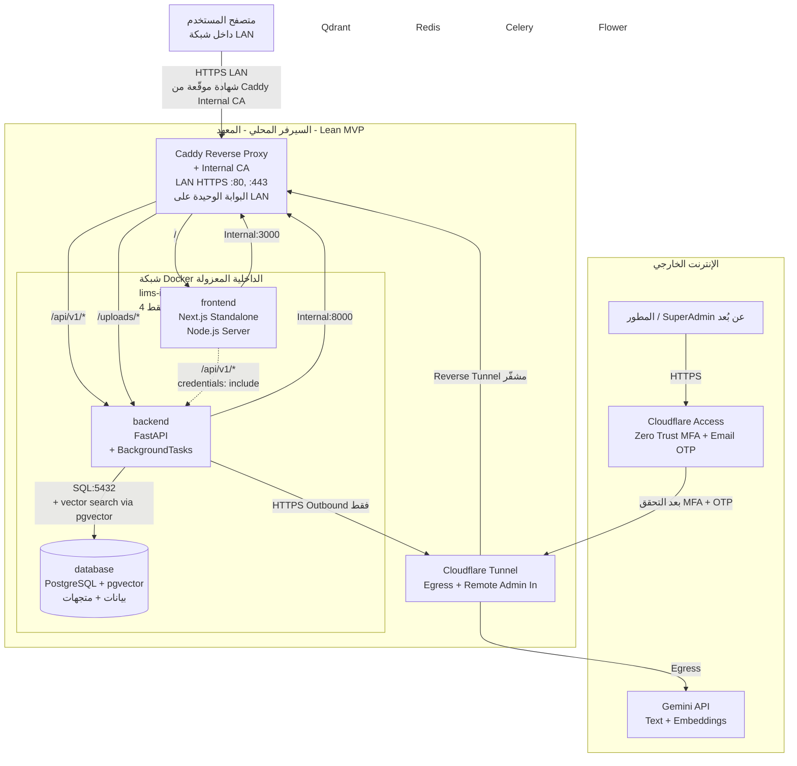
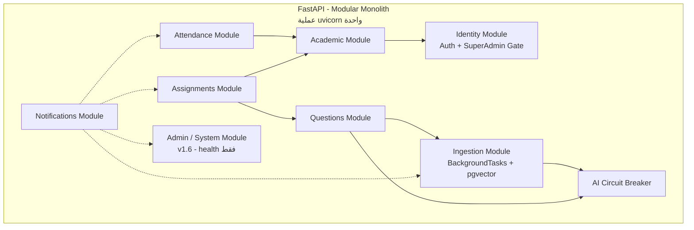
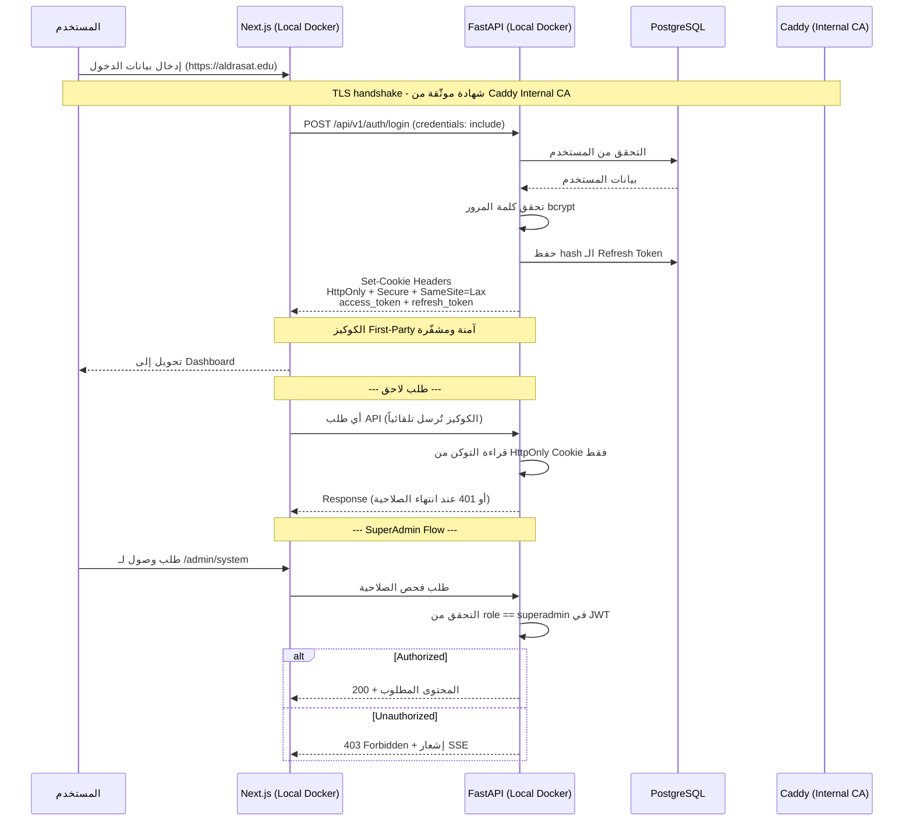
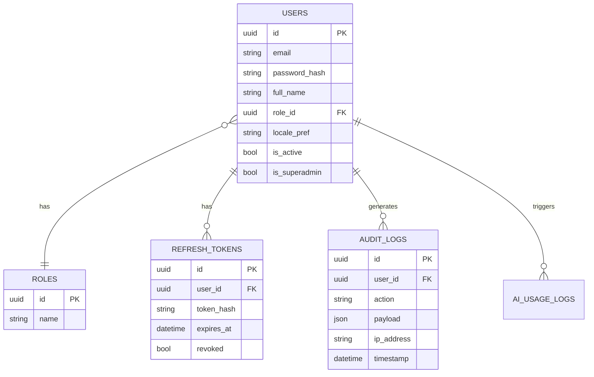
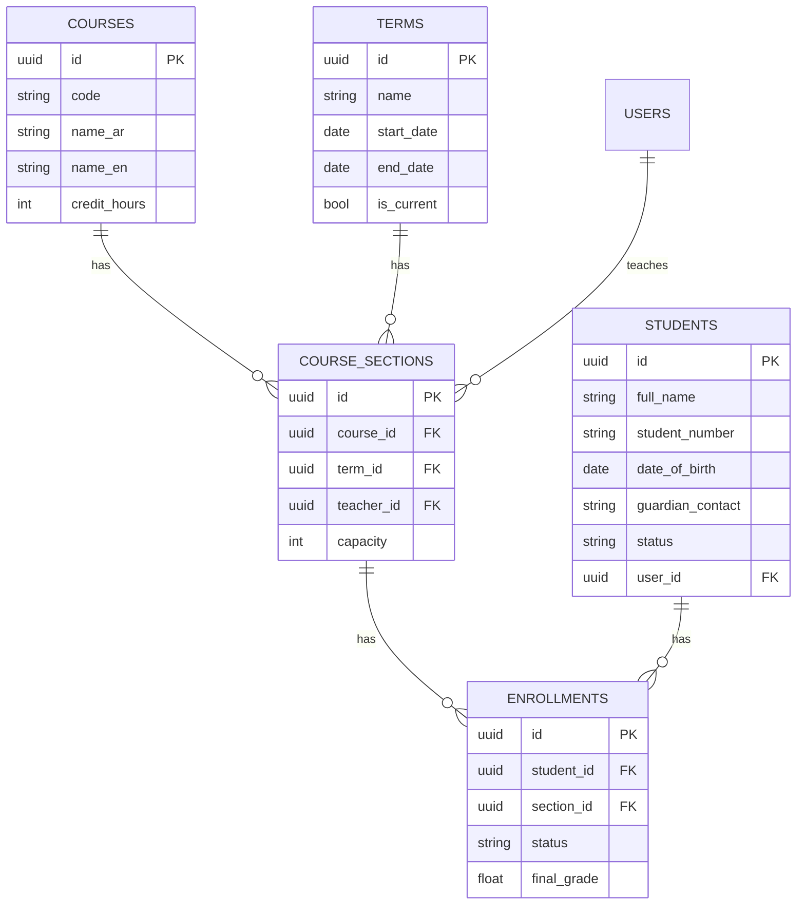
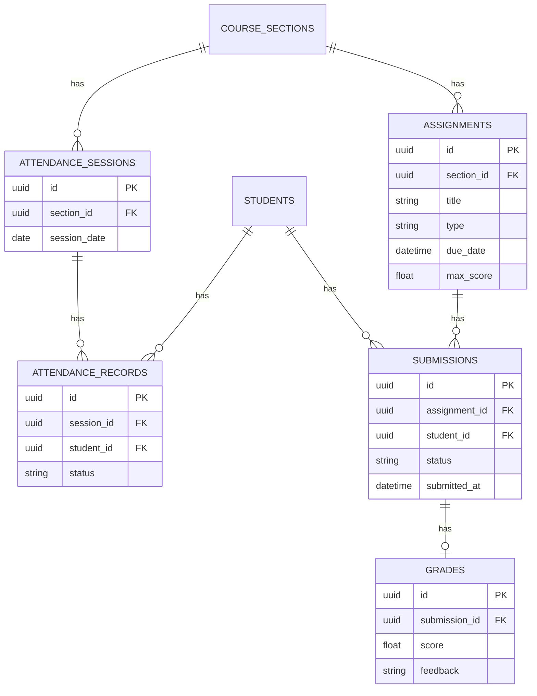
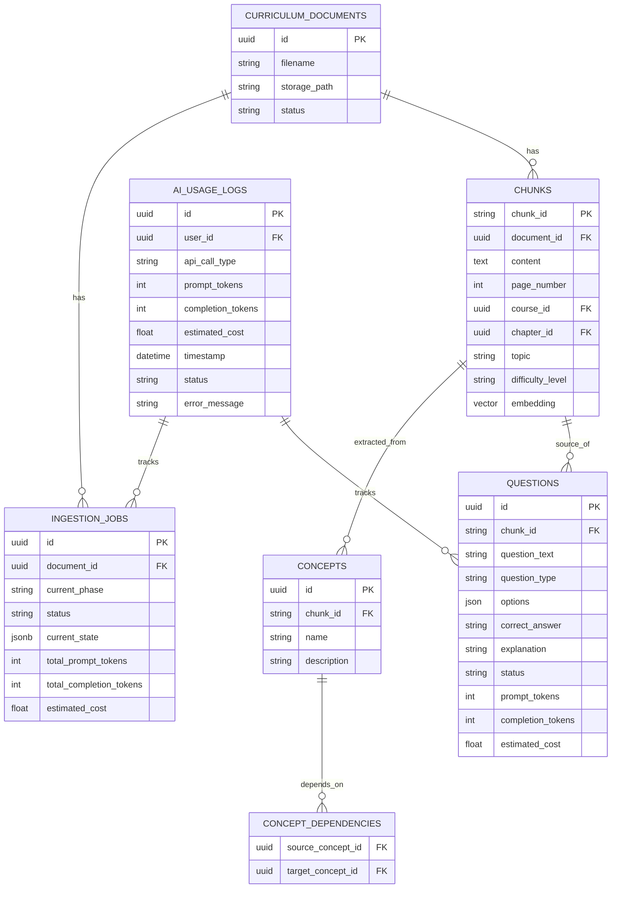
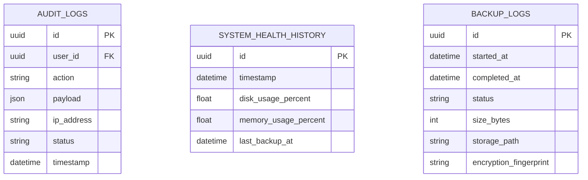
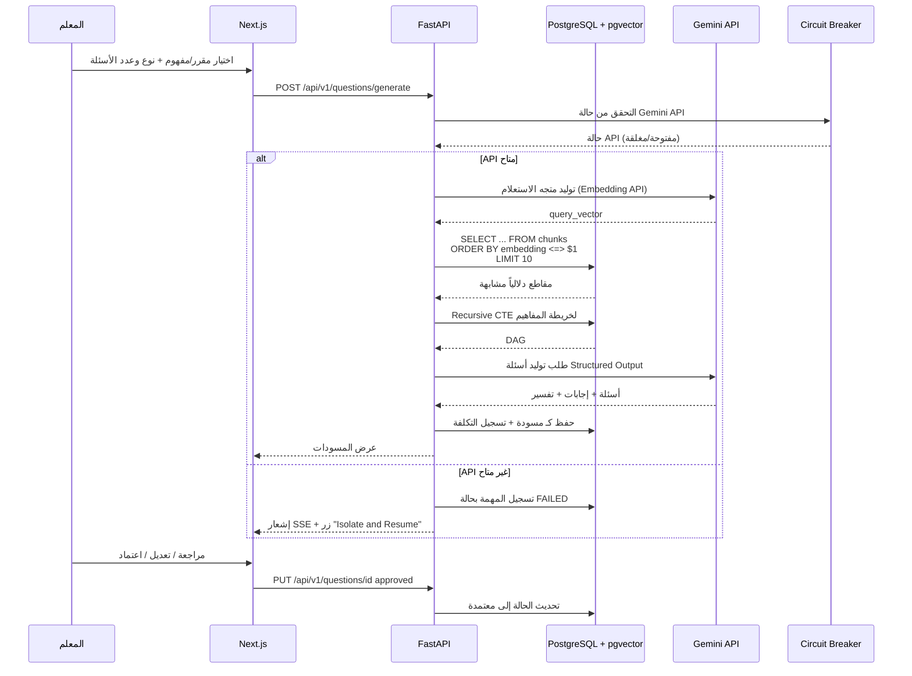
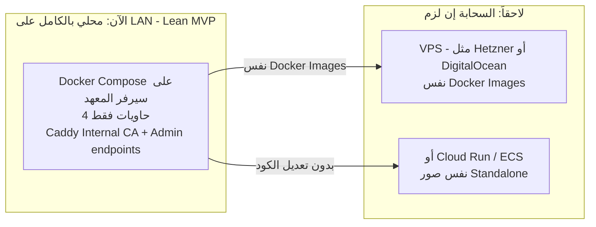

# نظام إدارة المعهد التعليمي (LIMS)
## وثيقة المرجع التقنية الشاملة

> هذا الملف هو المرجع الكامل للمشروع. يغطي المتطلبات، المعمارية، قاعدة البيانات، خط معالجة المناهج بالذكاء الاصطناعي، تصميم الـ API، وخطة التطوير التفصيلية. يُفترض تحديثه كل ما تغيّر قرار تقني مهم.

**الإصدار:** 1.6 (Lean MVP Edition) | **التاريخ:** يونيو 2026

> **سجل التغييرات (Changelog):**
> - **1.6 (يونيو 2026) — Lean MVP Edition:** تقليص جذري للبنية التحتية، وخفض عدد الحاويات من 8 إلى **4 حاويات أساسية فقط** تعمل على بروفايل موارد منخفض.
>     1. **إزالة Qdrant بالكامل:** تخلّينا عن قاعدة بيانات المتجهات المستقلة. **PostgreSQL** أصبح الآن **المصدر الوحيد للحقيقة** لكل من البيانات العلائقية ومتجهات الـ Embeddings، عبر إضافة **امتداد `pgvector`** إليه.
>     2. **إزالة Celery و Redis و Flower بالكامل:** لا يوجد broker خارجي، ولا طوابير مهام موزَّعة، ولا حاوية مراقبة. المعالجة غير المتزامنة أصبحت عبر **`BackgroundTasks` المدمج في FastAPI** — كافٍ تماماً لأن مهمة معالجة المناهج **شهرية** وقليلة التكرار.
>     3. **4 حاويات فقط:** `caddy` (Reverse Proxy + Local CA) + `frontend` (Next.js Standalone) + `backend` (FastAPI) + `database` (PostgreSQL + pgvector).
>     4. **تخزين المتجهات في PostgreSQL:** عمود `embedding VECTOR(1536)` على جدول `chunks` (متوافق مع Gemini Embedding API). البحث الدلالي عبر عامل cosine similarity المدمج في pgvector (`<=>`).
>     5. **"Isolate & Resume" مبسَّط:** يتتبّع التقدم عبر عمود `current_state` (JSONB) داخل جدول `ingestion_jobs` في PostgreSQL، معتمداً على `chunk_id` الحتمي (MD5) لمنع التكرار.
>     6. **النسخ الاحتياطي:** سكربت واحد ينفّذ `pg_dump` مضغوط (يحتوي على البيانات العلائقية + المتجهات) ويرفعه إلى S3/GCS. لا حاجة لنسخ Qdrant منفصل.
>     7. **المراقبة (Observability) مبسَّطة:** نقطة نهاية `GET /api/v1/admin/system/health` ترصد مساحة القرص، الذاكرة، وحالة اتصال قاعدة البيانات فقط. لا Flower، لا flush-queue.
>     8. **خطة التطوير:** حُذفت Phase 5 (Celery/Redis) و Phase 6 (Qdrant) بالكامل، وأُعيد توزيع المراحل للتركيز على بناء SIS/LMS وقاعدة بيانات موحَّدة.
>     تحديث شامل لأقسام 3، 4، 5، 6، 7، 10، 11، 12، 13، 14، 15، 16، 17، 18.
> - **1.5 (يونيو 2026):** ترقية شاملة للبنية التحتية والأمان والأداء.
>     1. **HTTPS محلي عبر Caddy (Internal CA):** استبدال Nginx بـ **Caddy Server** كـ Reverse Proxy وحيد يستمع على LAN. يعمل Caddy كـ **Internal Certificate Authority (Local CA)** لتوقيع شهادات HTTPS محلية، مما يُفعّل علم `Secure` على الكوكيز ويُنهي الحاجة لأي استثناءات متصفح.
>     2. **عزل شبكة Docker (LAN Bypass Fix):** إزالة `ports: "0.0.0.0:..."` لجميع الخدمات الخلفية. الخدمات الخلفية تستمع حصرياً على الشبكة الداخلية `lims-internal` لـ Docker Compose. **Caddy وحده** يعرض 80/443 على LAN.
>     3. **Cloudflare Zero Trust Access:** حماية الوصول الإداري عن بُعد عبر **Cloudflare Access (Zero Trust)** مع **MFA + Email OTP**، مفروض على مستوى Edge قبل أن تصل أي حزمة إلى الشبكة المحلية.
>     4. **معالجة مجمَّعة (Batch Ingestion):** تحديث Celery لتجميع المقاطع في دفعات (`Batch Size = 50`) وتنفيذ `Bulk Upsert` جماعي على Qdrant و PostgreSQL.
>     5. **Embeddings خارجية:** توليد المتجهات النصية عبر **Gemini Embedding API**.
>     6. **تخزين مؤقت لـ Recursive CTEs:** حد أعلى `depth <= 3` لاستعلامات خريطة المفاهيم، مع **Redis TTL = 24 ساعة**.
>     7. **نسخ احتياطي مصغَّر كل ساعتين (RPO = 2h):** `pg_dump` مضغوط + مُشفَّر (GPG) مرفوع إلى S3/GCS.
>     8. **Self-Healing Architecture:** حاوية **Flower** لمراقبة Celery، ونقاط نهاية إدارية في FastAPI لمراقبة الصحة وتنظيف المهام المعلَّقة.
> - **1.4 (يونيو 2026):** إزالة استضافة الفرونت اند على **Vercel (Cloud)** بالكامل. الانتقال إلى نشر **Next.js محلياً 100%** داخل **Docker Compose** كحاوية **Node.js Standalone** خلف Caddy.
> - **1.3 (يونيو 2026):** إزالة نظام المصادقة الهجين (Dual Auth Mode) بالكامل. توحيد آلية المصادقة على `HttpOnly Secure Cookies` كخيار وحيد للنظام.
> - **1.2 (يونيو 2026):** ...
> - **1.1 (يونيو 2026):** ...

---

## جدول المحتويات

1. نظرة عامة على المشروع
2. نطاق المشروع (MVP و Phase 2)
3. ملخص حزمة التقنيات
4. المتطلبات الوظيفية بالتفصيل
5. المتطلبات غير الوظيفية
6. المعمارية العامة للنظام
7. معمارية الباك اند (Backend)
8. معمارية الفرونت اند (Frontend)
9. المصادقة والصلاحيات (Auth & RBAC)
10. تصميم قاعدة البيانات
11. خط معالجة المناهج بالذكاء الاصطناعي
12. خدمة توليد الأسئلة بالذكاء الاصطناعي
13. الإشعارات الحية
14. لوحة التحليلات
15. تصميم الـ API
16. هيكلة المجلدات (Project Structure)
17. النشر والبنية التحتية
18. خطة التطوير التفصيلية
19. المخاطر والاعتبارات المستقبلية
20. الخطوات التالية

---

## 1. نظرة عامة على المشروع

LIMS هو نظام داخلي لإدارة معهد تعليمي واحد، يجمع بين:

- **SIS (Student Information System):** سجلات الطلاب، المقررات، الحضور، الجدولة.
- **LMS (Learning Management System):** الواجبات، التقييم، إدارة المناهج.
- **طبقة ذكاء اصطناعي:** معالجة المناهج المرفوعة (نصوص وصور) وتوليد أسئلة تلقائياً منها.

**القيود الأساسية التي تحكم كل قرار في هذا الملف:**

- المستخدمون الحاليون: ~30 (إدارة + مدرسين + SuperAdmin للنظام). الطلاب وأولياء الأمور لاحقاً.
- الإنترنت في بيئة الاستخدام (اليمن) ضعيف ومتقطع → **كل الوظائف الأساسية (SIS/LMS) تعمل 100% محلياً على شبكة الـ LAN دون أي اعتماد على الإنترنت**. الإنترنت يُعامَل كمورد **غير متزامن (Asynchronous Resource)** مطلوب فقط للمهام التي تستدعي Gemini API (Embeddings، توليد النصوص) والوصول الإداري عن بُعد.
- **أمان البنية التحتية:** الشبكة الداخلية لـ Docker Compose **مُعزَلة تماماً** عن الـ LAN، ولا خدمة خلفية تستمع مباشرة على واجهة المضيف. **Caddy** هو البوابة الوحيدة التي تواجه LAN، ويعمل كـ **Internal CA** لتوفير HTTPS محلي موثوق. الوصول الإداري عن بُعد محمي بـ **Cloudflare Zero Trust** (MFA + Email OTP).
- **مبدأ Lean MVP (v1.6):** البنية اختُزلت إلى **4 حاويات فقط**، وقاعدة بيانات واحدة (PostgreSQL + pgvector). لا Qdrant، لا Redis، لا Celery، لا Flower. هذا يقلّل التعقيد التشغيلي، ويخفض استهلاك الموارد، ويُسهّل الصيانة بشكل جذري.
- التكلفة يجب أن تكون منخفضة قدر الإمكان، حتى لو كانت البنية محلية بالكامل.
- إذا بدأنا محلياً، يجب أن تكون المعمارية قابلة للانتقال للسحابة دون إعادة هيكلة جذرية.
- المطور فردي، يستعين بالذكاء الاصطناعي في كتابة الكود → الكود يجب أن يكون نمطياً (modular) وواضح الحدود بين الوحدات.

---

## 2. نطاق المشروع

### MVP (الإصدار الأول)

| الوحدة | الوصف |
|---|---|
| الهوية والمستخدمين | تسجيل دخول Admin/Teacher/SuperAdmin عبر `HttpOnly Secure Cookies` (تحتوي على JWT) — على نفس النطاق المحلي مع HTTPS |
| الشؤون الأكاديمية | طلاب، مقررات، فصول، تسجيل |
| الحضور والجدولة | تسجيل حضور، جدول حصص بسيط |
| الواجبات والتقييم | إنشاء واجبات، رصد درجات |
| معالجة المناهج بالذكاء الاصطناعي | استخراج وهيكلة محتوى المناهج (نص + صور) — **عبر `BackgroundTasks` المدمج في FastAPI (تسلسلي شهري)** |
| توليد الأسئلة | توليد أسئلة من المحتوى المُعالج + مراجعة المعلم |
| الإشعارات | إشعارات حية بسيطة داخل النظام |
| **Self-Healing & Observability** | نقطة نهاية إدارية واحدة لمراقبة الصحة (القرص، الذاكرة، اتصال قاعدة البيانات) |
| لوحة التحليلات | تحاليل متوسطة (حضور، درجات، استخدام) |

### Phase 2 (مستقبلاً)

| الميزة | ملاحظة |
|---|---|
| بوابة الطلاب وأولياء الأمور | تتطلب حسابات دخول جديدة (role جديد) |
| الفواتير والمدفوعات | تحتاج تكامل دفع خارجي |
| شهادات تلقائية | PDF generation |
| مسارات تعلم شخصية | تستفيد من خريطة المفاهيم الموجودة بالفعل |
| Multi-tenant | لو احتجنا دعم معاهد متعددة |
| Push notifications على الموبايل | تتطلب تطبيق موبايل أو PWA متقدم |
| طابور مهام موزَّع | لو زاد حجم العمل وأصبح `BackgroundTasks` غير كافٍ، يمكن إضافة Redis + Celery لاحقاً (البنية جاهزة) |
| قاعدة متجهات مستقلة | لو تجاوز حجم الـ Embeddings ما يتحمله pgvector، يمكن إضافة Qdrant (لكن لن نحتاجه قبل عشرات الملايين من المتجهات) |

البنية في هذا الملف مصمَّمة بحيث **لا تحتاج إعادة هيكلة** لإضافة أي من هذه الميزات لاحقاً (تفاصيل ذلك مذكور في كل قسم).

---

## 3. ملخص حزمة التقنيات

| الطبقة | التقنية | السبب |
|---|---|---|
| Frontend | Next.js + TypeScript | SSR وتحميل تدريجي، دعم رسمي للوضع Standalone Self-Hosted |
| Styling | Tailwind CSS | خفيف، لا CSS زائد |
| State/Data Fetching | TanStack Query | تخزين مؤقت يقلل الطلبات على الشبكة المحلية |
| **استضافة الفرونت اند** | **Local Server عبر Docker Compose (حاوية Next.js Standalone Node.js)** خلف **Caddy** | إزالة كاملة للاعتمادية على الإنترنت؛ تعمل 100% على LAN |
| **Reverse Proxy + Local CA** | **Caddy Server** | **الوحيد الذي يستمع على LAN (80/443)**، يعمل كـ **Internal Certificate Authority** لتوقيع شهادات HTTPS محلية، يدعم HTTP/3. |
| Backend | Python + FastAPI | أداء، تكامل AI، **يحتوي على `BackgroundTasks` مدمج** للمعالجة غير المتزامنة |
| **المعالجة غير المتزامنة** | **`BackgroundTasks` (مدمج في FastAPI)** | لا حاجة لـ broker خارجي. مناسب لأن مهمة معالجة المناهج **شهرية ومنخفضة الحجم** |
| ORM | SQLAlchemy 2.0 + Alembic | قياسي، يدعم migrations و Bulk operations |
| **قاعدة البيانات (بيانات علائقية + متجهات)** | **PostgreSQL + امتداد `pgvector`** | **مصدر وحيد للحقيقة**؛ يدعم Recursive CTEs، Bulk Upsert، وعامِل cosine similarity (`<=>`) للبحث الدلالي |
| **تخزين المتجهات** | **`VECTOR(1536)` داخل PostgreSQL** | يلغي الحاجة لـ Qdrant تماماً؛ حجم المناهج المعقول لا يتجاوز قدرة pgvector |
| المصادقة | `HttpOnly Secure Cookies` (JWT) | **`Secure` flag مفعَّل** بفضل HTTPS المحلي من Caddy Internal CA |
| الذكاء الاصطناعي (متعدد الوسائط) | Gemini 1.5 Flash + **Gemini Embedding API** (نص → متجه) | رخيص وسريع؛ الـ Embeddings تتطلب **اتصالاً صاعداً نشطاً** بالإنترنت |
| إعادة المحاولة عند الفشل | tenacity | exponential backoff عند rate limits |
| إدارة فشل AI | Circuit Breaker (`pybreaker`) | للتعامل بأناقة مع فشل Gemini أو استنفاد حدود الاستخدام |
| تقييم جودة RAG | RAGAS | مكتبة بايثون مجانية |
| **🆕 حالة المهام في DB** | **`current_state JSONB` على `ingestion_jobs`** | **بديل مبسَّط لـ Redis** لتتبّع تقدم المعالجة والاستئناف (Isolate & Resume) |
| الإشعارات الحية | **SSE عبر استعلامات PostgreSQL** (دوري) | أبسط من Redis Pub/Sub؛ لا حاجة لطبقة إضافية |
| الحاويات | Docker + Docker Compose | **4 حاويات فقط** — يسهّل الانتقال من محلي إلى أي سحابة |
| الوصول الصاعد للإنترنت | Cloudflare Tunnel (Egress Only) | Outbound لـ Gemini API فقط |
| **Remote Admin Lockdown** | **Cloudflare Access (Zero Trust)** | الوصول عن بُعد محمي بـ **MFA + Email OTP**، مفروض على Edge قبل أي دخول للشبكة المحلية |
| النسخ الاحتياطي | micro-backup كل 2 ساعة (8ص-8م) | سكربت واحد: `pg_dump` مضغوط + مُشفَّر (GPG) → رفع إلى S3/GCS. **يحتوي على البيانات العلائقية والمتجهات معاً** |
| السيرفر التشغيلي | Ubuntu Linux | مستقر ومجاني |

### 🆕 قائمة الحاويات النهائية في v1.6

| # | اسم الحاوية | الدور | كشف LAN؟ |
|---|---|---|---|
| 1 | `caddy` | Reverse Proxy + Internal CA | ✅ **80 + 443 فقط** |
| 2 | `frontend` | Next.js Standalone (Node.js) | ❌ لا كشف LAN |
| 3 | `backend` | FastAPI (مع `BackgroundTasks`) | ❌ لا كشف LAN |
| 4 | `database` | PostgreSQL + pgvector | ❌ لا كشف LAN |

**المجموع: 4 حاويات.** لا Qdrant، لا Redis، لا Celery، لا Flower.

---

## 4. المتطلبات الوظيفية بالتفصيل

### 4.1 الهوية والمستخدمين
- تسجيل دخول/خروج، تجديد الجلسة عبر refresh token.
- الأدوار الحالية: `superadmin` (لإدارة النظام والنسخ الاحتياطية)، `admin`, `teacher`. الجدول مصمَّم لإضافة `student`, `parent` دون migration معقدة (موضَّح في قسم 10).
- Admin فقط يُنشئ حسابات المدرسين. SuperAdmin فقط يُنشئ حسابات Admin.

### 4.2 الشؤون الأكاديمية
- إدارة السنوات/الفصول الدراسية (Terms).
- إدارة المقررات (Courses) وفصول التدريس (Course Sections) المرتبطة بمدرّس وفصل دراسي.
- سجلات الطلاب (بيانات شخصية، حالة القيد) — بدون حساب دخول في MVP.
- التسجيل (Enrollment) في الفصول.

### 4.3 الحضور والجدولة
- تسجيل حضور لكل جلسة دراسية (حاضر/غائب/متأخر/معفى).
- جدول حصص أسبوعي مبسّط لكل فصل دراسي (وقت، يوم، قاعة).

### 4.4 الواجبات والتقييم
- إنشاء واجبات/اختبارات (نوع، تاريخ تسليم، الدرجة القصوى).
- بما أن الطلاب لا يملكون حسابات في MVP، المدرّس يسجّل حالة التسليم والدرجة بنفسه.

### 4.5 معالجة المناهج بالذكاء الاصطناعي (🆕 مبسَّطة في v1.6)
- رفع ملف منهج (PDF/DOCX، نص وصور).
- استخراج وهيكلة المحتوى إلى مقاطع قابلة للاسترجاع.
- **🆕 تنفيذ عبر `BackgroundTasks` المدمج في FastAPI:** FastAPI يستقبل الملف، يُرجع `202 Accepted` فوراً، ويُجدوِل المعالجة في الـ event loop الخاص بعملية uvicorn نفسها. لا يوجد broker منفصل.
- **🆕 تخزين المتجهات في PostgreSQL:** كل مقطع يُخزَّن مع `embedding VECTOR(1536)` في عمود مخصَّص.
- **جدولة يدوية:** مهمة غير متكررة (شهرية)، يقوم المستخدم برفع الملف في أوقات الاتصال المستقر، ويختار وقت بدء المعالجة.

### 4.6 توليد الأسئلة
- توليد أسئلة (اختيار متعدد، صح/خطأ، إجابة قصيرة) من محتوى مُعالج.
- **البحث الدلالي RAG** ينفَّذ عبر استعلام SQL واحد يستخدم عامل cosine similarity (`<=>`) المدمج في pgvector.
- مراجعة المعلم واعتماد قبل الاستخدام الفعلي (تفاصيل في قسم 12).
- في حال فشل استدعاء Gemini، تنتقل المهمة إلى حالة `FAILED` ويستأنفها المستخدم عبر زر **"Isolate & Resume"**.

### 4.7 الإشعارات
- إشعار عند: انتهاء معالجة منهج، رصد درجة، نشر واجب جديد.
- إشعارات إضافية عند فشل مهام الذكاء الاصطناعي.
- **🆕 إشعارات صحة النظام** (SuperAdmin فقط): تنبيه عند امتلاء القرص > 85%.

### 4.8 Self-Healing & Admin Operations (🆕 مبسَّط في v1.6)
- **🆕 نقطة نهاية إدارية واحدة فقط في FastAPI** (SuperAdmin):
    - `GET /api/v1/admin/system/health` — يعيد JSON بحالة: مساحة القرص، استخدام الذاكرة، وحالة اتصال PostgreSQL.
- **🆕 لا Flower، لا flush-queue** (لأن Redis غير موجود أصلاً).
- **لا حاجة لـ SSH** لتنفيذ هذه العمليات؛ تتم من واجهة LIMS نفسها.

### 4.9 لوحة التحليلات
- معدلات حضور، توزيع درجات، نسبة إكمال واجبات، إحصائيات المعالجة بالذكاء الاصطناعي.
- تتبع استهلاك الرموز (Tokens Usage) والتكلفة التقديرية لمهام الذكاء الاصطناعي.
- **🆕 مؤشرات Self-Healing** (SuperAdmin): حالة آخر backup، uptime التطبيق.

---

## 5. المتطلبات غير الوظيفية

| المتطلب | كيف نحققه |
|---|---|
| **أمان النقل (Transport Security)** | **HTTPS محلي مفروض عبر Caddy Internal CA** على LAN. كل حركة LAN بين المتصفح و Caddy مشفَّرة. |
| **عزل الشبكة (Network Isolation)** | **شبكة Docker `lims-internal` مخصصة.** الخدمات الخلفية (FastAPI, PostgreSQL) **لا تكشف أي بورت للمضيف** (لا `0.0.0.0:...`). فقط Caddy يكشف 80/443 على LAN. |
| **أمان الوصول عن بُعد (Zero Trust)** | **Cloudflare Access (Zero Trust)** مفروض على الوصول الإداري الخارجي. يتطلب **MFA + Email OTP** من المطور/SuperAdmin قبل أن تصل أي حزمة إلى Caddy. |
| **الأمان العام** | `HttpOnly Secure Cookies` (JWT) + bcrypt/argon2 + RBAC (3-tier: superadmin/admin/teacher) + Pydantic validation + Rate limiting |
| **التشغيل دون إنترنت** | **كل الوظائف الأساسية (SIS/LMS) تعمل 100% Offline** على LAN. الإنترنت مورد غير متزامن: (1) استدعاءات FastAPI الصاعدة إلى Gemini API، (2) الوصول الإداري عن بُعد. **استثناء:** البحث الدلالي RAG يتطلب Embeddings حية؛ عند انقطاع الإنترنت، البحث يُعيد نتائج فارغة مع رسالة واضحة (ولا يُسقط النظام). |
| **التكلفة المنخفضة** | كل المكونات مفتوحة المصدر. لا رسوم استضافة سحابية. **4 حاويات فقط** = استهلاك ذاكرة و CPU أدنى بكثير. |
| **الأداء** | Next.js SSR + code splitting على LAN (< 5ms). **`pgvector` + `HNSW` index** لاستعلامات cosine similarity في < 50ms حتى على ملايين المتجهات. |
| **قابلية الانتقال للسحابة** | كل شيء داخل Docker؛ صورة Next.js Standalone قابلة للنشر في Vercel/Cloud Run/ECS بتعديل `start` script فقط. |
| **متانة البيانات (RPO = 2h)** | **micro-backup كل ساعتين** بين 8:00 ص و 8:00 م: `pg_dump` مضغوط (يحتوي على البيانات + المتجهات) + مُشفَّر (GPG) → رفع إلى S3/GCS. |
| **قابلية الملاحظة (Observability)** | **نقطة نهاية إدارية واحدة** + إشعارات SSE بسيطة لصحة النظام. لا حاجة لأدوات خارجية. |
| **إدارة حالة AI** | Circuit Breaker + Tenacity + مهام FAILED قابلة للاستئناف + تتبع التكلفة |
| **🆕 بساطة العمليات (v1.6)** | 4 حاويات فقط، قاعدة بيانات واحدة، لا broker خارجي. **مطوّر فردي يستطيع فهم وصيانة كل شيء بنفسه.** |

---

## 6. المعمارية العامة للنظام



**ملاحظة معمارية مهمة (محدَّثة في v1.6 — Lean MVP):**

- **🆕 4 حاويات فقط:** `caddy`, `frontend`, `backend`, `database`. لا Qdrant، لا Redis، لا Celery، لا Flower. هذا يقلّل تعقيد النشر والصيانة بنسبة 50%.
- **Caddy هو البوابة الوحيدة على LAN.** يستمع على `0.0.0.0:80` و `0.0.0.0:443`، ويوزّع الحركة:
    - `/` و `/ar/*` و `/en/*` → حاوية `frontend` (Next.js Standalone).
    - `/api/v1/*` و `/uploads/*` → حاوية `backend` (FastAPI).
- **Caddy Internal CA:** يستخرج Root CA محلي ويوقّع شهادات HTTPS لـ `aldrasat.edu`. يُصدِّر Root CA إلى أجهزة العميل عبر صفحة تنزيل مؤمَّنة (أو توزيع يدوي). هذا يُفعّل `Secure` على الكوكيز ويُنهي الحاجة لأي استثناء متصفح.
- **عزل الشبكة (LAN Bypass Fix):** الخدمات الخلفية (FastAPI على 8000، PostgreSQL على 5432) **لا تستمع على `0.0.0.0`** في `docker-compose.yml`؛ فقط على شبكة `lims-internal` الداخلية. لا يمكن لأي جهاز على LAN الوصول إليها مباشرة. اختبار التحقق: `nmap 192.168.x.x -p 5432` يجب أن يُظهر الفلترة فقط.
- **Cloudflare Access (Zero Trust):** الوصول عن بُعد محمي بمجموعة قواعد Zero Trust: قائمة بريدية مُعتمدة + MFA (TOTP) + Email OTP. **حتى لو سُرّب Tunnel Token**، المهاجم لا يستطيع الدخول بدون OTP.
- **🆕 البحث الدلالي RAG** ينفَّذ كاستعلام SQL واحد على PostgreSQL باستخدام عامل cosine distance (`<=>`) المدمج في pgvector. لا توجد شبكة داخلية إضافية.
- **🆕 المعالجة غير المتزامنة (Ingestion)** تجري داخل عملية uvicorn نفسها عبر `BackgroundTasks` المدمج في FastAPI. المهمة الشهرية لا تستدعي broker منفصل.
- **🆕 Cloudflare Tunnel** محصور في: (1) Egress إلى Gemini API، (2) Inbound من Cloudflare Access (Zero Trust-authenticated) فقط.

---

## 7. معمارية الباك اند (Backend)

نبدأ بـ **Modular Monolith**: تطبيق FastAPI واحد، لكن كل domain (وحدة) معزولة في مجلدها الخاص بحدود واضحة.



**كل module يتبع البنية الداخلية نفسها:**
- `router.py` — نقاط الـ API
- `schemas.py` — Pydantic models للـ request/response
- `models.py` — SQLAlchemy models
- `service.py` — منطق العمل
- `dependencies.py` — حقن التبعيات (auth check، الخ)

**🆕 نمط تشغيل واحد فقط في v1.6 (لا Celery Worker):**
- `uvicorn app.main:app` — عملية API الرئيسية فقط. تستضيف `BackgroundTasks` للمعالجة غير المتزامنة.
- **🆕 لا توجد عملية worker منفصلة.** كل المهام الثقيلة (معالجة المناهج) تُجدوَل عبر `BackgroundTasks` من FastAPI وتنفَّذ في الـ event loop الخاص بعملية uvicorn.

**مكتبات أساسية:** FastAPI, SQLAlchemy 2.0 (Bulk Operations + JSONB), Alembic, Pydantic v2, passlib (bcrypt) أو argon2-cffi, pyjwt, **pgvector** (عبر `psycopg[binary]`), tenacity, slowapi, `pybreaker`, `psutil` (لمراقبة القرص/الذاكرة), pytest.

**🆕 الحذف من v1.5 → v1.6:**
- ❌ `celery` و `redis-py` و `qdrant-client` (لم تعد مطلوبة).
- ✅ استُبدلت بـ: `BackgroundTasks` (مدمج) + عمود `embedding VECTOR(1536)` + استعلامات cosine similarity.

---

## 8. معمارية الفرونت اند (Frontend)

**Next.js (App Router) + TypeScript**، مع:

- **حماية المسارات (Auth Guards) وتدويل اللغات (i18n):** Next.js Middleware افتراضي.
- **Tailwind CSS**: تصميم خفيف.
- **TanStack Query**: تخزين مؤقت للطلبات.
- **React Hook Form + Zod**: نماذج وتحقق.
- **Recharts**: رسومات لوحة التحليلات.
- **PWA**: غير مطلوب الآن، لكن البنية تسمح بإضافته لاحقاً.

**وضع البناء (Build Mode) — Standalone Self-Hosted:**
- يُبنى الفرونت اند بإعداد `output: 'standalone'` في `next.config.js` ليُنتج حاوية Node.js واحدة صغيرة مستقلة بذاتها، تُوضع داخل `frontend/Dockerfile` (متعدد المراحل: `node:20-alpine` للبناء، ثم نسخة خفيفة للتشغيل).
- تُشغَّل الحاوية بأمر: `node server.js`.
- **Caddy** يُوجّه طلبات `/` و `/ar/*` و `/en/*` إلى حاوية `frontend`، وطلبات `/api/v1/*` إلى حاوية `backend`.

**آلية المصادقة في الفرونت اند (نهائي ومبسَّط):**
- الباك اند يضع الـ Access/Refresh Tokens في `HttpOnly Secure Cookies` عند تسجيل الدخول.
- الفرونت اند يعتمد على إرسال الكوكيز تلقائياً مع كل طلب عبر `credentials: 'include'`.
- **السبب التقني:** Caddy يعمل كـ **Internal CA** ويوقّع شهادات HTTPS موثوقة محلياً لـ `aldrasat.edu` (مع تصدير Root CA لأجهزة العميل). النتيجة:
    - **HTTPS مفعَّل على LAN** → علم `Secure` على الكوكيز **يعمل بشكل قاطع**.
    - لا حاجة لأي `SameSite=None; Secure` أو workaround.
    - الإعداد `Secure + SameSite=Lax + HttpOnly` كافٍ تماماً وآمن.

---

## 9. المصادقة والصلاحيات (Auth & RBAC)

> **القاعدة المعمارية الموحدة (Single Auth Mode):** النظام يعتمد **حصريةً** على `HttpOnly Secure Cookies` لإدارة الجلسات والمصادقة. **بفضل HTTPS المحلي من Caddy Internal CA**، علم `Secure` مفعَّل بشكل قاطع — لا حاجة لأي استثناء متصفح.



### بنية التوكنات والكوكيز

- **Access Token:** صلاحية قصيرة (15-30 دقيقة)، يُحفظ في `HttpOnly Secure Cookie` باسم `access_token`. يحتوي claims: `sub` (user_id)، `role`، `is_superadmin`، `exp`.
- **Refresh Token:** صلاحية أطول (7 أيام)، يُحفظ في `HttpOnly Secure Cookie` منفصل باسم `refresh_token`. **Rotation** نشط.
- **إعدادات الكوكيز النهائية:**
    - `HttpOnly`: ✅
    - `Secure`: ✅ (يعمل 100% على LAN بفضل Caddy Internal CA)
    - `SameSite=Lax`: ✅
    - `Path=/`: ✅
    - `Domain`: يُترك فارغاً (الكوكيز خاصة بنطاق LAN المحلي، `aldrasat.edu`).
- **CSRF Protection:** `SameSite=Lax` للعمليات العادية + Origin/Referer check في الباك اند للعمليات الحساسة.

### هيكل الصلاحيات — ثلاثي المستويات

| المستوى | الـ Role | الصلاحيات | الاستخدام |
|---|---|---|---|
| **System Level** | `superadmin` | إدارة النظام، النسخ الاحتياطية، Health Dashboard | المطور/مدير البنية |
| **Tenant Level** | `admin` | إدارة المستخدمين (Teacher فقط)، المقررات، الفصول، الطلاب، الواجبات، التحليلات الكاملة | إدارة المعهد |
| **Classroom Level** | `teacher` | إدارة فصوله، الواجبات، الحضور، رفع المناهج، التوليد والمراجعة | المعلم |

### قواعد الباك اند (FastAPI)

- **مصدر التوكن الوحيد:** FastAPI يقرأ التوكن **حصرياً** من `request.cookies`.
- **SuperAdmin Gate:** جميع المسارات تحت `/api/v1/admin/*` تتطلب `role == 'superadmin'` (يُحقَّق عبر dependency injection مركزي).
- **أمن كلمات المرور:** bcrypt (cost ≥ 12) أو argon2id، rate limiting على `/api/v1/auth/login`.
- **سجل التدقيق (Audit Log):** كل عملية SuperAdmin (backup-restore، تغيير root cert، إلخ) تُسجَّل في جدول `audit_logs` مع: user_id، action، timestamp، payload.

### قواعد الفرونت اند (Next.js)

- **لا تخزين في المتصفح** لأي توكن.
- **اعتراض 401** في طبقة `apiClient` عبر interceptor Axios.
- **حماية المسارات** عبر Next.js Middleware.
- **صفحة Admin:** `/admin/system` مرئية فقط لـ SuperAdmin، تعرض Health Dashboard وآخر حالة backup.

### مصفوفة الصلاحيات (MVP)

| الصلاحية | SuperAdmin | Admin | Teacher |
|---|---|---|---|
| إدارة المستخدمين | ✅ (كامل) | ✅ (Teacher فقط) | ❌ |
| إدارة المقررات/الفصول | ✅ | ✅ | عرض فصوله فقط |
| تسجيل الطلاب | ✅ | ✅ | ❌ |
| تسجيل الحضور | ✅ | ✅ | ✅ (لفصوله) |
| إدارة الواجبات | ✅ | ✅ | ✅ (لفصوله) |
| رفع مناهج للمعالجة | ✅ | ✅ | ✅ |
| اعتماد الأسئلة المولّدة | ✅ | ✅ | ✅ (لفصوله) |
| لوحة التحليلات الكاملة | ✅ | ✅ | عرض جزئي |
| **/api/v1/admin/system/health** | ✅ | ❌ | ❌ |
| **إدارة النسخ الاحتياطية** | ✅ | ❌ | ❌ |
| **إنشاء حسابات Admin** | ✅ | ❌ | ❌ |

---

## 10. تصميم قاعدة البيانات

### 10.1 الهوية



> **v1.6 ترقية:** لا تغييرات على هذا القسم مقارنة بـ v1.5. **`is_superadmin BOOLEAN`** على `USERS` كـ flag سريع للتحقق. جدول `AUDIT_LOGS` لتسجيل كل عملية إدارية حرجة.

### 10.2 الشؤون الأكاديمية



### 10.3 الحضور والواجبات



### 10.4 خط الذكاء الاصطناعي (RAG) وتتبع الاستهلاك (🆕 مبسَّط في v1.6)



**توضيحات على مخطط الذكاء الاصطناعي (v1.6 — مبسَّط):**

- **🆕 CHUNKS.embedding `VECTOR(1536)`:** عمود جديد يخزن متجه Gemini Embedding مباشرةً. **هذا يلغي الحاجة لـ Qdrant**. الفهرسة عبر `HNSW` index على هذا العمود توفّر بحث cosine similarity في < 50ms.
- **🆕 INGESTION_JOBS.current_state `JSONB`:** عمود جديد يستبدل `current_batch_index` و `ingestion_batches` و DAG cache في Redis. يخزّن:
  - آخر صفحة مُعالَجة (`last_page`)
  - آخر chunk_id نجح (`last_successful_chunk_id`)
  - عدّاد الـ chunks المعالَجة (`processed_count`)
  - طابع زمني للـ checkpoint (`checkpoint_at`)
  - **استخدامه:** زر "Isolate & Resume" يقرأ هذا العمود لمعرفة نقطة الاستئناف. لا حاجة لجدول `ingestion_batches` منفصل، ولا Redis cache.
- **🆕 حذف `ingestion_batches`:** لم يعد مطلوباً. الـ `current_state` في `ingestion_jobs` يكفي.
- **🆕 حذف جدول `asset_cache`:** الـ `chunk_id` الحتمي (MD5) + `ON CONFLICT DO UPDATE` في PostgreSQL كافيان للـ Deduplication.
- **`chunk_id` حتمي (Deterministic):** `MD5 Hash` لنص المقطع + `asset_id`. يمنع التكرار، يُمكِّن زر "Isolate & Resume".
- **🆕 استعلامات Upsert في PostgreSQL فقط:** `ON CONFLICT DO UPDATE` للـ Single، `INSERT ... VALUES (...), (...), ... ON CONFLICT (chunk_id) DO UPDATE` للـ Bulk.
- **🆕 البحث الدلالي (RAG):** استعلام SQL واحد:
  ```sql
  SELECT chunk_id, content, embedding <=> $1 AS distance
  FROM chunks
  WHERE document_id IN (SELECT id FROM curriculum_documents WHERE status = 'COMPLETED')
    AND course_id = $2
  ORDER BY embedding <=> $1
  LIMIT 10;
  ```
  حيث `$1` هو متجه الاستعلام (مُولَّد من نص البحث عبر Gemini Embedding API). pgvector يعيد أقرب 10 مقاطع دلالياً في < 50ms.

### 10.5 سجل التدقيق والمراقبة (🆕 مبسَّط في v1.6)



- **AUDIT_LOGS:** كل عملية SuperAdmin (backup-restore، تغيير root cert، تعديل إعدادات).
- **🆕 SYSTEM_HEALTH_HISTORY (مبسَّط):** عينات دورية (كل 5 دقائق) من `/api/v1/admin/system/health` — تغذية رسومات Recharts. **🆕 إزالة أعمدة Celery و Qdrant** التي لم تعد ذات معنى.
- **BACKUP_LOGS:** سجل بكل micro-backup (وقت، حجم، حالة، fingerprint تشفير).

---

## 11. خط معالجة المناهج بالذكاء الاصطناعي (🆕 مبسَّط في v1.6)

```mermaid
graph TD
    A[رفع ملف منهج (PDF/DOCX)] --> B{FastAPI: 202 Accepted + job_id}
    B --> C[حفظ الملف محلياً + جدولة BackgroundTask]
    C --> D[قراءة current_state من ingestion_jobs]
    D --> E{Isolate & Resume?}
    E -->|نعم| F[استئناف من last_page + last_successful_chunk_id]
    E -->|لا| G[بدء من الصفحة 1]

    subgraph BackgroundTask[BackgroundTask داخل عملية uvicorn]
        F --> H[تحليل التخطيط (Layout Analysis)<br/>صفحة بصفحة]
        G --> H
        H --> I[التجزيء الدلالي (Semantic Chunking)]
        I --> J[MD5 hash لإنشاء chunk_id حتمي]
        J --> K[توليد Embedding<br/>Gemini Embedding API]
        K --> L[استخراج الكيانات ووسم البيانات التربوية (Google ADK)]
        L --> M[Batch Bulk Upsert<br/>PostgreSQL فقط]
        M --> N[تحديث current_state<br/>JSONB checkpoint]
    end

    N --> O[بناء خريطة المعرفة DAG]
    O --> P[PostgreSQL Recursive CTE<br/>depth <= 3]
    P --> Q[لا Cache - استعلام مباشر]

    Q --> R[المرحلة 4: التحقق والصيانة]
    subgraph P4[المرحلة 4: التحقق والصيانة]
        R --> S[تقييم آلي RAGAS]
        S --> T[تحديث حالة المهمة إلى COMPLETED]
        T --> U[إشعار المستخدم]
    end

    U --> V[أداة Hotfix للتعديل اليدوي]

    U -.->|فشل بسبب انقطاع الإنترنت| W[FAILED]
    W -->|ضغط زر Isolate and Resume| E
```

### تفاصيل كل خطوة (v1.6 — مع BackgroundTasks و pgvector)

1.  **الرفع والجدولة عبر `BackgroundTasks`:** FastAPI يستقبل الملف عبر `POST /api/v1/curriculum/documents`، يُرجع `202 Accepted` + `job_id` فوراً، يحفظ الملف خلف `StorageService` interface، ثم يُضيف دالة `process_ingestion(job_id)` إلى `BackgroundTasks`. **تنفَّذ الدالة في الـ event loop الخاص بعملية uvicorn بعد إرسال الـ response.** لا يوجد broker منفصل.

2.  **جدولة يدوية للمعالجة (Human-Driven Scheduling):** مهمة غير متكررة (شهرية). الواجهة تُرشد المستخدم لرفع الملفات في أوقات الاتصال المستقر، مع خياري "Run Now" / "Schedule for later".

3.  **🆕 Checkpointing عبر `current_state` (JSONB):** عند كل نقطة استئناف، يُحدَّث `ingestion_jobs.current_state` بـ:
    ```json
    {
      "last_page": 12,
      "last_successful_chunk_id": "a1b2c3d4...",
      "processed_count": 87,
      "checkpoint_at": "2026-06-18T22:15:00Z"
    }
    ```
    يُكتب مرة كل عدة صفحات لتقليل الحمل على DB. **استبدال كامل لـ `ingestion_batches` و Redis cache.**

4.  **تحليل التخطيط:** صفحة بصفحة، مع `Layout Analysis` يُسجَّل عدد الصفحات المُعالَجة.

5.  **التجزيء الدلالي:** حسب الحدود الدلالية (فقرات/أقسام). `chunk_id` ثابت (MD5) هو المرساة الدائمة.

6.  **Deduplication (MD5):** `MD5 Hash` للعنصر + `asset_id`، بحث في `chunks` عبر `chunk_id` PK، تخطي إن وُجد. لا حاجة لجدول `asset_cache` منفصل.

7.  **معالجة الوسائط المتعددة:** Gemini 1.5 Flash لوصف الصور، مغلَّفة بـ `tenacity` (exponential backoff) و `pybreaker` (Circuit Breaker). عند تكرار الفشل، تفشل المهمة بأناقة → `FAILED` + إشعار SSE.

8.  **الاستخراج والوسم التربوي:** دفعات 5-10 مقاطع لكل استدعاء عبر Google ADK. Bloom's Taxonomy، المتطلبات السابقة، زمن القراءة.

9.  **توليد Embeddings:** **استدعاء Gemini Embedding API** لتوليد المتجهات النصية (1536 بُعد). **هذا يعني أن البحث الدلالي RAG يستلزم اتصالاً صاعداً نشطاً بـ Gemini وقت الاستعلام (لإنشاء متجه الاستعلام)**. في وضع الـ Offline الكامل، البحث يُعيد نتائج فارغة مع رسالة واضحة.

10. **🆕 Batch Bulk Upsert إلى PostgreSQL فقط (v1.6):** كل دفعة (50 chunk) تُكتب مرة واحدة عبر:
    - `INSERT ... VALUES (...), (...), ... ON CONFLICT (chunk_id) DO UPDATE` — استعلام واحد مجمَّع للبيانات العلائقية.
    - **عمود `embedding VECTOR(1536)` يُحدَّث في نفس الـ INSERT.**
    - **`ingestion_jobs.current_state` يُحدَّث مرة كل عدة صفحات.**
    - **لا استدعاء منفصل لـ Qdrant.**

11. **خريطة المعرفة DAG:** `concepts` و `concept_dependencies` في PostgreSQL.
    - **حد العمق:** `WITH RECURSIVE ... WHERE depth <= 3` — استعلام محدود بعمق 3 قفزات.
    - **🆕 لا Redis Cache:** الاستعلام رخيص (depth ≤ 3 + فهرس على FKs)، ينفَّذ مباشرة على PostgreSQL. في حالة نادرة من الضغط العالي، يمكن إضافة Redis cache في Phase 2.

12. **التقييم والـ Hotfix:** RAGAS يفحص دقة الاسترجاع بأسئلة تجريبية. أداة Hotfix تعدّل chunk واحداً وتعيد حساب متجهه فقط.

### إدارة الفشل بسبب انقطاع الإنترنت — **"Isolate & Resume" (v1.6 — مبسَّط)**

- **انتقال لحالة `FAILED`:** عند فشل استدعاء Gemini (Timeout, ConnectionError, Circuit Open) أثناء أي مرحلة، ينتقل `ingestion_jobs.status` إلى **`FAILED`**.
- **🆕 قراءة `current_state`:** زر "Isolate & Resume" يقرأ `ingestion_jobs.current_state` ويعرف آخر نقطة نجاح (`last_page` + `last_successful_chunk_id`).
- **🆕 استئناف من `last_successful_chunk_id`:** المعالجة تتجاوز كل الـ chunks ذات `chunk_id <= last_successful_chunk_id` بفضل `ON CONFLICT (chunk_id) DO NOTHING` ثم تكمل من `last_page + 1`.
- **لا Redis، لا broker، لا عملية worker منفصلة.** كل شيء داخل PostgreSQL وعملية uvicorn واحدة.

---

## 12. خدمة توليد الأسئلة بالذكاء الاصطناعي (🆕 مبسَّط في v1.6)



- **أنواع الأسئلة المدعومة في MVP:** اختيار متعدد، صح/خطأ، إجابة قصيرة.
- كل سؤال يحتفظ بمرجع `chunk_id` للمصدر.
- **🆕 البحث الدلالي (RAG) عبر pgvector:** استعلام SQL واحد باستخدام عامل `<=>` (cosine distance) — يلغي الحاجة لـ Qdrant client.
- **🆕 فلترة Metadata في SQL:** عبر `WHERE` clauses عادية (`course_id`, `chapter_id`, `curriculum_documents.status = 'COMPLETED'`).
- **🆕 خريطة المفاهيم:** Recursive CTE مباشرة، **بدون Redis cache** (الاستعلام رخيص مع `depth <= 3`).
- **إدارة حالة AI:** Circuit Breaker + FAILED + زر Isolate & Resume.

---

## 13. الإشعارات الحية (🆕 مبسَّط في v1.6)

اخترنا **Server-Sent Events (SSE)** بدل WebSockets. **في v1.6، لا حاجة لـ Redis Pub/Sub:**

- **🆕 قناة in-process:** FastAPI يحتفظ بـ `asyncio.Queue` per connected user داخل عملية uvicorn.
- نقطة `/api/v1/notifications/stream` في FastAPI تفتح اتصال SSE لكل مستخدم متصل، وتستمع للـ queue الخاص به.
- **🆕 النشر من المعالجة غير المتزامنة:** دالة `BackgroundTask` تستدعي `notifications_service.push(user_id, event)` التي تكتب على `asyncio.Queue` الصحيح (لا عبور للشبكة، لا Redis).
- **أنواع الإشعارات في v1.6:**
    - انتهاء معالجة منهج.
    - رصد درجة / نشر واجب.
    - فشل مهمة AI / Circuit Open.
    - **🆕 إشعار SuperAdmin: استخدام القرص > 85%.**
    - **🆕 إشعار SuperAdmin: micro-backup ناجح أو فاشل.**
- الفرونت اند يستخدم `EventSource` العادي.
- **حدود v1.6:** إذا تم تشغيل أكثر من uvicorn worker في المستقبل، الإشعارات ستعمل على worker واحد فقط (يمكن إضافة Redis Pub/Sub في Phase 2). MVP يعمل على worker واحد، فلا مشكلة.

---

## 14. لوحة التحليلات

تحاليل متوسطة المستوى:

- معدل الحضور، توزيع الدرجات، نسبة إكمال الواجبات.
- إحصائيات خط المعالجة (عدد المهام، معدل النجاح، متوسط وقت المعالجة).
- إحصائيات الأسئلة المولّدة.
- تتبع استهلاك الـ AI (Tokens، التكلفة، المحاولات الفاشلة).
- **🆕 (SuperAdmin) لوحة Self-Healing (مبسَّطة):**
    - رسم بياني لمساحة القرص والذاكرة على مدار 24 ساعة.
    - عدد micro-backups الناجحة/الفاشلة.
    - Uptime التطبيق (uvicorn).
    - RPO الفعلي (الفجوة بين آخر backup ناجح والوقت الحالي).

تُحسب عبر استعلامات تجميع مباشرة (aggregation queries) — لا حاجة لمستودع تحليلات منفصل.

---

## 15. تصميم الـ API

| المجموعة | مثال على نقاط النهاية |
|---|---|
| Auth | `POST /api/v1/auth/login`, `POST /api/v1/auth/refresh`, `POST /api/v1/auth/logout` |
| Users | `GET/POST /api/v1/users` |
| Academic | `GET/POST /api/v1/students`, `/api/v1/courses`, `/api/v1/course-sections`, `/api/v1/enrollments` |
| Attendance | `POST /api/v1/attendance/sessions`, `POST /api/v1/attendance/sessions/{id}/records` |
| Assignments | `GET/POST /api/v1/assignments`, `/api/v1/assignments/{id}/submissions`, `/api/v1/grades` |
| Ingestion | `POST /api/v1/curriculum/documents`، `GET /api/v1/curriculum/jobs/{id}`، `POST /api/v1/curriculum/jobs/{id}/resume` (Isolate & Resume)، `POST /api/v1/curriculum/chunks/{chunk_id}/hotfix` |
| Questions | `POST /api/v1/questions/generate`, `POST /api/v1/questions/{id}/resume`, `GET/PUT /api/v1/questions/{id}` |
| Notifications | `GET /api/v1/notifications/stream` (SSE) |
| Analytics | `GET /api/v1/analytics/dashboard`, `GET /api/v1/analytics/ai-usage` |
| **🆕 Admin / System (SuperAdmin)** | **`GET /api/v1/admin/system/health`** (القرص + الذاكرة + حالة PostgreSQL فقط)، `GET /api/v1/admin/backups`، `POST /api/v1/admin/backups/{id}/restore` |
| **🆕 Audit** | `GET /api/v1/admin/audit-logs` (SuperAdmin) |

(بالإضافة لعمليات CRUD المعتادة على كل كائن أعلاه.)

> **🆕 ملاحظة v1.6:** جميع نقاط الـ API تحت بادئة `/api/v1/` موحَّدة. **🆕 أُزيلت نقطة `flush-queue`** لأن Redis لم يعد موجوداً. **🆕 أُزيلت نقطة `/flower`** لأن حاوية Flower لم تعد موجودة.

---

## 16. هيكلة المجلدات (Project Structure)

### Backend

```
backend/
├── app/
│   ├── main.py
│   ├── core/            # config, security, dependencies, circuit_breaker, superadmin_gate
│   ├── db/               # session, base models
│   ├── modules/
│   │   ├── identity/      # users, auth, roles
│   │   ├── academic/      # courses, terms, students, enrollments
│   │   ├── attendance/
│   │   ├── assignments/
│   │   ├── ingestion/     # خط معالجة المناهج مع BackgroundTasks + pgvector
│   │   ├── questions/     # توليد الأسئلة
│   │   ├── notifications/ # in-process asyncio.Queue
│   │   └── admin/         # v1.6 - SuperAdmin endpoints
│   │       ├── router.py   # /system/health فقط
│   │       ├── service.py  # psutil integration
│   │       └── schemas.py
│   ├── services/
│   │   └── backup.py       # micro-backup logic
│   └── tests/
├── alembic/               # migrations
├── docker-compose.yml     # يضم 4 حاويات: caddy, frontend, backend, database
├── caddy/
│   ├── Caddyfile          # Internal CA + routing
│   └── root_ca.crt        # Local Root CA cert
└── Dockerfile
```

> **🆕 الحذف من v1.5 → v1.6:**
> - ❌ `app/workers/` (لم تعد هناك عملية Celery worker)
> - ❌ `app/services/dag_cache.py` (استُبدل بـ Recursive CTE مباشرة)
> - ❌ `app/workers/batch_ingestion.py` (استُبدل بـ `app/modules/ingestion/service.py` يستخدم `BackgroundTasks`)

### Frontend

```
frontend/
├── app/
│   ├── [locale]/
│   │   ├── (auth)/login/
│   │   ├── (dashboard)/
│   │   │   ├── students/
│   │   │   ├── courses/
│   │   │   ├── attendance/
│   │   │   ├── assignments/
│   │   │   ├── ingestion/        # زر Isolate & Resume
│   │   │   ├── questions/        # زر Isolate & Resume
│   │   │   ├── analytics/
│   │   │   └── admin/             # SuperAdmin فقط
│   │   │       ├── system/        # Health dashboard
│   │   │       ├── backups/       # Backup logs
│   │   │       └── audit/         # Audit logs
│   └── layout.tsx
├── components/
├── lib/                   # api client, auth helpers
├── messages/              # ar.json, en.json
├── Dockerfile
├── .dockerignore
└── next.config.js         # output: 'standalone'
```

### Infrastructure

```
infrastructure/
├── docker-compose.yml
├── docker-compose.prod.yml
├── caddy/
│   ├── Caddyfile
│   ├── root_ca.crt
│   └── root_ca.key
├── cloudflared/
│   └── config.yml         # Zero Trust access rules
├── backups/
│   └── micro-backup.sh    # يعمل كل 2h - pg_dump واحد فقط
└── monitoring/
    └── health-check.sh
```

> **🆕 الحذف من v1.5 → v1.6:**
> - ❌ لا مجلد `qdrant/` (لا توجد إعدادات Qdrant)
> - ❌ لا مجلد `redis/` (لا توجد إعدادات Redis)
> - ❌ لا مجلد `flower/` (لا توجد حاوية Flower)

---

## 17. النشر والبنية التحتية



### 🆕 خدمات Docker Compose محلياً (v1.6 — 4 حاويات فقط)

| # | الخدمة | الدور | كشف LAN؟ | الموارد (حد أقصى) |
|---|---|---|---|---|
| 1 | `caddy` | **Reverse Proxy + Internal CA** | ✅ **80 + 443 فقط** (البوابة الوحيدة) | 0.5 CPU / 256MB |
| 2 | `frontend` | حاوية Next.js Standalone (Node.js) — بورت داخلي 3000 | ❌ لا كشف LAN | 1 CPU / 512MB |
| 3 | `backend` | FastAPI — بورت داخلي 8000 | ❌ لا كشف LAN | 2 CPU / 2GB |
| 4 | `database` | PostgreSQL + **pgvector** — بورت داخلي 5432 | ❌ **لا كشف LAN** | 2 CPU / 2GB |

**المجموع: 4 حاويات.** **🆕 بروفايل موارد منخفض:** ~5.5 CPU و ~5GB ذاكرة كحد أقصى — يعمل على سيرفر متوسط المواصفات أو حتى VPS صغير.

> **التحقق من العزل:** `nmap <server-lan-ip> -p 1-10000` من جهاز LAN **يجب** أن يُظهر فقط `80/tcp` و `443/tcp` مفتوحتين. أي بورت آخر (5432, 8000) **يجب** أن يكون filtered/rejected.

> **🆕 الحذف من v1.5 → v1.6:** حُذفت صفوف `redis`، `qdrant`، `celery-worker`، `flower`، و`cloudflared` كحاوية منفصلة (أُدمجت كـ sidecar اختياري في المرحلة المتقدمة فقط).

### إعدادات Caddy (v1.6) — `Caddyfile` كنموذج

```caddyfile
{
    # Internal CA configuration
    pki {
        ca local {
            name "LIMS Internal CA"
            root_cn "LIMS Root CA"
        }
    }
}

aldrasat.edu {
    tls internal               # شهادة موقّعة من Caddy Internal CA
    encode gzip

    # Frontend
    reverse_proxy frontend:3000

    # API
    reverse_proxy /api/v1/* backend:8000
    reverse_proxy /uploads/* backend:8000
}
```

> **🆕 الحذف من v1.5 → v1.6:** حُذف قسم `@flower` بالكامل (لا حاوية Flower، لا Forward Auth للـ superadmin).
>
> **Root CA Export:** يُصدَّر `root_ca.crt` عبر سكربت setup يُنزِّله Admin مرة واحدة على كل جهاز عميل (`lims-admin.local/setup-ca`).

### 🆕 النسخ الاحتياطي — micro-backup مبسَّط (سكربت واحد فقط)

**الفلسفة (v1.6):** تقليص نافذة فقدان البيانات إلى **ساعتين كحد أقصى**، عبر سكربت micro-backup واحد ينفّذ `pg_dump` واحد (يحتوي على البيانات العلائقية + المتجهات معاً).

**الجدولة:** كل ساعتين بين 8:00 ص و 8:00 م (6 نسخ يومياً في ساعات العمل).

**السكربت — `micro-backup.sh` (نموذج):**

```bash
#!/usr/bin/env bash
# v1.6: Micro-backup every 2h during 8:00-20:00
# ينفّذ pg_dump واحد (بيانات + متجهات) مضغوط + مشفّر ويرفعه إلى S3/GCS
set -euo pipefail

TIMESTAMP=$(date +%Y%m%d_%H%M%S)
BACKUP_FILE="/tmp/lims_backup_${TIMESTAMP}.sql.gz"
ENCRYPTED_FILE="${BACKUP_FILE}.gpg"
GPG_RECIPIENT="lims-backup@institute.local"  # مفتاح GPG مُولَّد مرة واحدة

# 1. pg_dump مضغوط (يحتوي على البيانات + عمود embedding VECTOR(1536))
docker exec database pg_dump -U lims -d lims | gzip > "${BACKUP_FILE}"

# 2. تشفير GPG (مفتاح عام فقط)
gpg --batch --yes --trust-model always \
    -e -r "${GPG_RECIPIENT}" "${BACKUP_FILE}"

# 3. رفع إلى S3/GCS عبر rclone
rclone copy "${ENCRYPTED_FILE}" \
    "remote:lims-backups/daily/$(date +%Y-%m-%d)/"

# 4. تسجيل في جدول BACKUP_LOGS
curl -X POST http://backend:8000/api/v1/admin/backups/log \
    -H "Content-Type: application/json" \
    -d "{\"timestamp\": \"${TIMESTAMP}\", \"size\": $(stat -c%s ${ENCRYPTED_FILE}), \"status\": \"OK\"}"

# 5. تنظيف محلي
rm -f "${BACKUP_FILE}" "${ENCRYPTED_FILE}"
```

**جدولة `cron` على السيرفر:**
```cron
0 8-20/2 * * * /opt/lims/infrastructure/backups/micro-backup.sh >> /var/log/lims-backup.log 2>&1
```

**سياسة الاحتفاظ:** آخر 7 أيام في `daily/`، آخر 4 أسابيع في `weekly/`، آخر 12 شهراً في `monthly/` (rclone lifecycle policy على الـ bucket).

**الاستعادة:** SuperAdmin يستدعي `POST /api/v1/admin/backups/restore` → السكربت يفك التشفير محلياً، يُرجع الـ DB إلى آخر نقطة نظيفة. يُسجَّل في `AUDIT_LOGS`.

> **🆕 الحذف من v1.5 → v1.6:** حُذف سطر نسخ Qdrant المنفصل — لم يعد مطلوباً لأن المتجهات داخل PostgreSQL.

### 🆕 Self-Healing Architecture (v1.6 — مبسَّط جذرياً)

**🆕 لا حاوية Flower في v1.6.** المراقبة تتم عبر نقطة نهاية إدارية واحدة فقط.

**`GET /api/v1/admin/system/health`** (SuperAdmin):
```json
{
  "status": "healthy",
  "timestamp": "2026-06-18T22:00:00Z",
  "disk": {
    "total_gb": 500,
    "used_gb": 312,
    "usage_percent": 62.4
  },
  "memory": {
    "total_gb": 16,
    "used_gb": 8.2,
    "usage_percent": 51.3
  },
  "postgres": {
    "status": "up",
    "connections": 12,
    "pgvector_version": "0.7.0"
  },
  "last_backup": {
    "timestamp": "2026-06-18T20:00:00Z",
    "status": "OK",
    "size_mb": 312
  },
  "rpo_hours": 2,
  "app_uptime_hours": 168
}
```

> **🆕 الحذف من v1.5 → v1.6:** حُذفت أقسام `redis`، `qdrant`، `celery`، و `flush-queue` بالكامل من الـ response. المراقبة محصورة في: **القرص + الذاكرة + PostgreSQL + آخر backup + uptime التطبيق.**

**🆕 لا `/api/v1/admin/system/flush-queue`:** لأن Redis غير موجود أصلاً، ولا طوابير مهام موزَّعة.

**مراقبة الموارد (`psutil` integration):** FastAPI يجمع عينات كل 5 دقائق في `SYSTEM_HEALTH_HISTORY` لتغذية Recharts في لوحة SuperAdmin.

### Cloudflare Access (Zero Trust) — `cloudflared/config.yml`

```yaml
tunnel: <tunnel-id>
credentials-file: /etc/cloudflared/<tunnel-id>.json

ingress:
  # 1. Remote Admin (Zero Trust protected)
  - hostname: admin.aldrasat.edu
    service: http://caddy:443
    originRequest:
      noTLSVerify: false
  # 2. Catch-all (egress-only pattern)
  - service: http_status:404
```

**Zero Trust Rules (في Cloudflare Dashboard):**
- التطبيق: `admin.aldrasat.edu`
- Policy: `Allow` للمستخدمين في `superadmin@institute.local` و `dev@institute.local`
- Authentication: **Email OTP + MFA (TOTP)**
- Session duration: 1 ساعة

> **🆕 ملاحظة v1.6:** لا حاجة لـ `cloudflared` كحاوية Docker Compose دائمة. يمكن تشغيله كـ system service على السيرفر، أو عند الطلب فقط.

### 🆕 عزل موارد السيرفر المحلي (v1.6 — مبسَّط)

- **حاوية Backend (FastAPI + BackgroundTasks):** `deploy.resources.limits: cpus=2, memory=2G` — تستضيف كل من API والمهام غير المتزامنة.
- **حاوية Caddy:** حدود `cpus=0.5, memory=256M` (خفيفة).
- **حاوية Database (PostgreSQL + pgvector):** `cpus=2, memory=2G`، مع `shared_buffers` معدَّل.
- **حاوية Frontend (Next.js Standalone):** `cpus=1, memory=512M`.

**المجموع:** ~5.5 CPU و ~5GB ذاكرة كحد أقصى. **🆕 مقارنة بـ v1.5 (≈ 11 CPU و ≈ 13GB)، البنية الجديدة تعمل على بروفايل موارد أقل من النصف.**

### التكلفة (v1.6)

كل المكونات مفتوحة المصدر أو خطة مجانية. **التكلفة الوحيدة** هي استهلاك Gemini API (Text + Embeddings). لا رسوم Vercel أو استضافة سحابية. Cloudflare Zero Trust: **مجاني** حتى 50 مستخدم. **🆕 استهلاك موارد السيرفر انخفض بأكثر من 50%** بفضل تقليص الحاويات.

---

## 18. خطة التطوير التفصيلية (🆕 مُعاد توزيعها في v1.6)

> تقديرات الوقت تفترض عملاً فردياً بمساعدة الذكاء الاصطناعي، بدوام جزئي.
> **🆕 تم حذف Phase 5 و Phase 6 من v1.5** (كانت مخصَّصة لـ Celery/Redis و Qdrant). أُعيد توزيع المراحل للتركيز على: **البنية الأساسية الموحَّدة + SIS/LMS + pgvector + BackgroundTasks**.

### Phase 0 — التأسيس (1-2 أسابيع)
- إعداد المستودع، Docker Compose.
- **🆕 pgvector:** اختيار صورة PostgreSQL تدعم الامتداد (مثل `pgvector/pgvector:pg16`)، تفعيله في `init.sql`، اختبار `CREATE EXTENSION vector` و `SELECT '[1,2,3]'::vector`.
- **Caddy Internal CA:** إعداد `Caddyfile` بـ `pki` block + `tls internal`، توليد Root CA، سكربت تصدير الشهادة.
- **🆕 ضبط `docker-compose.yml` بـ 4 حاويات فقط** على شبكة `lims-internal` معزولة. التحقق من عدم وجود `ports: "0.0.0.0:..."` على أي حاوية غير Caddy.
- **🆕 حاوية Next.js Standalone** + `frontend/Dockerfile` متعدد المراحل.
- هيكلة FastAPI + health check.
- هيكلة Next.js + i18n + Standalone build.
- إدارة الإعدادات (.env + Pydantic Settings).
- نموذج المستخدم + `HttpOnly Secure Cookies` (مع `Secure` مفعَّل 100% بفضل Caddy).
- **توزيع Root CA على جهاز Admin** (تثبيت في Keychain على macOS، Cert Store على Windows).

### Phase 1 — الهوية وإدارة المستخدمين (أسبوع واحد)
- إضافة `is_superadmin` column + role `superadmin`.
- تدوين `AUDIT_LOGS` على كل عملية Auth.
- الأدوار (superadmin/admin/teacher)، CRUD للمستخدمين.
- تسجيل الدخول/الخروج، refresh tokens، middleware الحماية.
- واجهة تسجيل الدخول + Dashboard محمي.

### Phase 2 — النظام الأكاديمي الأساسي (2-3 أسابيع)
- السنوات/الفصول الدراسية، المقررات، فصول التدريس.
- الطلاب (CRUD، سجلات)، التسجيل.
- واجهات الإدارة لكل ما سبق.

### Phase 3 — الحضور والجدولة (1-2 أسبوع)
- نقاط API لجلسات وسجلات الحضور.
- جدول حصص مبسّط.
- واجهات المعلم والإدارة.

### Phase 4 — الواجبات والتقييم (2 أسابيع)
- CRUD للواجبات، التسليمات، الدرجات.
- رفع ملفات (خلف StorageService).
- واجهات المعلم.

### 🆕 Phase 5 — خط معالجة المناهج بالذكاء الاصطناعي (2-3 أسابيع) — مبسَّط
> **🆕 (دمج v1.5 Phase 5 + Phase 6 + Qdrant work في مرحلة واحدة مبسَّطة)**
- **🆕 جدول `chunks` بعمود `embedding VECTOR(1536)`:** إنشاء migration يُضيف العمود + `HNSW` index (`USING hnsw (embedding vector_cosine_ops)`).
- **🆕 استبدال Celery بـ `BackgroundTasks`:** تنفيذ `process_ingestion(job_id)` كدالة `async` تُضاف إلى `BackgroundTasks` بعد رفع الملف.
- **🆕 عمود `ingestion_jobs.current_state JSONB`:** استبدال `current_batch_index` و `ingestion_batches` بعمود واحد مرن.
- **🆕 حذف Qdrant client:** استبدال استدعاءات `qdrant_client.upsert()` بـ `INSERT ... ON CONFLICT (chunk_id) DO UPDATE` على PostgreSQL.
- **🆕 Bulk Insert للـ Embeddings:** استخدام `psycopg[binary]` مع `executemany` أو `COPY` لتحديث عمود `embedding` بكفاءة.
- **🆕 البحث الدلالي (RAG):** استعلام SQL واحد بـ `embedding <=> $1` كبديل لـ Qdrant search.
- **🆕 Batch API call لـ Gemini Embedding:** استدعاء `embed_content` بـ batch inputs لكل دفعة مقاطع.
- **🆕 حذف Redis DAG Cache:** استبدال `dag_cache.py` بـ Recursive CTE مباشرة (depth ≤ 3).
- جدولة يدوية + UI.
- Checkpointing عبر `current_state`، Deduplication (MD5).
- معالجة الوسائط (Gemini + tenacity + Circuit Breaker).
- الاستخراج المجمَّع والوسم التربوي.
- تقييم RAGAS + Hotfix UI.
- زر **Isolate & Resume** (يقرأ `current_state`).

### 🆕 Phase 6 — توليد الأسئلة (1-2 أسبوع) — مبسَّط
- **🆕 استبدال Qdrant search بـ pgvector `<=>` operator** في خدمة التوليد.
- خدمة التوليد + فلترة Metadata في SQL.
- تدفق المراجعة/الاعتماد.
- **🆕 حذف استعلام Redis DAG Cache** (استعلام Recursive CTE مباشرة).
- زر **Isolate & Resume** لمهام التوليد.

### Phase 7 — الإشعارات الحية (3-5 أيام)
- **🆕 استبدال Redis Pub/Sub بـ `asyncio.Queue` in-process** داخل FastAPI.
- مركز إشعارات + `EventSource` في الفرونت.
- **🆕 إشعارات صحة النظام** (SuperAdmin: قرص ممتلئ، backup فاشل).

### Phase 8 — لوحة التحليلات (أسبوع واحد)
- استعلامات التجميع.
- Recharts.
- **🆕 لوحة SuperAdmin (مبسَّطة):** Health dashboard، Backup logs، Audit logs. **🆕 لا رسومات لـ Celery workers أو Qdrant collections** (لم تعد موجودة).

### Phase 9 — الأمان والاختبار (1-2 أسبوع)
- Rate limiting، input validation، فحص التبعيات.
- اختبارات pytest.
- **🆕 اختبار سيناريو "LAN Bypass":** `nmap` من جهاز LAN، التأكد أن 5432/8000 filtered.
- **🆕 اختبار HTTPS Local:** التأكد من `Secure` flag في Chrome DevTools على LAN.
- **🆕 اختبار pgvector:** استعلام بـ `<=>` على 10K متجه، التأكد من < 50ms.
- **🆕 اختبار BackgroundTasks:** رفع ملف أثناء قطع الإنترنت → المهمة FAILED → استئناف.
- استراتيجية النسخ الاحتياطي وتفعيلها.

### Phase 10 — النشر (3-5 أيام)
- **🆕 ضبط Docker Compose Production:**
    - بناء صور Production لكل من Frontend (Standalone) و Backend.
    - **التحقق بـ `docker compose config`:** فقط Caddy يكشف 80/443.
    - **شبكة `lims-internal` معزولة** (التحقق بـ `docker network inspect`).
    - **🆕 التحقق من 4 حاويات فقط:** `docker compose ps` يجب أن يُظهر 4 صفوف بالضبط.
- **Caddy Production:**
    - `Caddyfile` النهائي مع Internal CA.
    - تصدير Root CA على صفحة setup مؤمَّنة.
- **Cloudflare Access (Zero Trust):** إعداد Tunnel + Policies (Email OTP + MFA) لـ `admin.aldrasat.edu`.
- **🆕 micro-backup مبسَّط:** نشر `micro-backup.sh` + إضافة cron entry، اختبار استعادة (يحتوي على بيانات + متجهات).
- **🆕 اختبارات قبول v1.6:**
    - **Offline 100%:** فصل الإنترنت، التأكد من SIS/LMS يعمل.
    - **LAN Bypass:** `nmap` يُظهر فقط 80/443.
    - **Secure Cookies:** Chrome DevTools → Application → Cookies → `Secure` ✅.
    - **Isolate & Resume:** قطع الإنترنت أثناء Ingestion، استئناف من `current_state`.
    - **RPO = 2h:** التحقق من آخر backup age < 2h.
    - **Zero Trust:** محاولة الوصول لـ admin subdomain بدون OTP → مرفوض.
    - **🆕 Lean MVP Verification:** `docker ps` يُظهر 4 حاويات فقط. لا Qdrant، لا Redis، لا Celery، لا Flower.
- **ضبط `deploy.resources.limits`** لجميع الحاويات.
- مراقبة أساسية (logs، uptime check، إشعارات SSE).

### Phase 11+ — مستقبلي (خارج النطاق الحالي)
بوابة الطلاب/أولياء الأمور، المدفوعات، الشهادات، مسارات التعلم الشخصية، Multi-tenant، Push notifications، **إضافة Redis + Celery** لو تجاوز الحجم قدرة `BackgroundTasks`، **إضافة Qdrant** لو تجاوز حجم المتجهات عشرات الملايين (البنية جاهزة لاستيعاب ذلك دون إعادة تصميم).

---

## 19. المخاطر والاعتبارات المستقبلية

- **نقطة فشل واحدة:** السيرفر المحلي غير مكرر. **التخفيف:** micro-backup كل ساعتين → RPO = 2h، مشفَّر (GPG) ومرفوع لـ S3/GCS خارج الموقع الجغرافي.
- **اعتماد على إنترنت المعهد:** **تم تخفيف هذه المخاطرة جذرياً:**
    - كل الوظائف الأساسية (SIS/LMS) تعمل Offline 100% على LAN.
    - **استثناء وحيد:** البحث الدلالي RAG يتطلب Gemini Embedding API live call (عند الـ query).
    - **استثناء ثاني:** معالجة المناهج (Ingestion) تتطلب Gemini Text API + Embedding API.
    - في وضع الـ Offline الكامل، Ingestion لا يعمل والبحث الدلالي يُعيد نتائج فارغة مع رسالة واضحة. النظام لا ينهار.
- **🆕 بساطة معمارية (v1.6):** 4 حاويات فقط = سطح هجوم أصغر، صيانة أبسط، أخطاء تشغيلية أقل. **🆕 تحذير:** إذا أُضيفت حاويات جديدة في المستقبل، يجب الحفاظ على مبدأ "لا تضيف شيئاً إلا إذا كان لا بديل له".
- **🆕 حدود `BackgroundTasks` (v1.6):** في v1.6، المعالجة غير المتزامنة تجري داخل عملية uvicorn. لو أصبح التطبيق متعدد الـ workers في المستقبل، لن يصل إشعار SSE لكل worker. **التخفيف:** نبدأ بـ worker واحد، نراقب، وننتقل لـ Redis Pub/Sub في Phase 2 إذا لزم.
- **🆕 حدود `pgvector` (v1.6):** pgvector يخدم ملايين المتجهات بكفاءة مع HNSW index. **التخفيف:** لو تجاوز الحجم ذلك (احتمال ضعيف لمعهد)، يمكن إضافة Qdrant في Phase 2 — البنية جاهزة.
- **اختراق الشبكة الداخلية (LAN Bypass):** **التخفيف:** عزل شبكة Docker `lims-internal`، لا توجد بورتات مضيفة مكشوفة. Caddy هو البوابة الوحيدة. اختبار `nmap` دوري.
- **سرقة Tunnel Token:** **التخفيف:** Cloudflare Access (Zero Trust) يفرض MFA + Email OTP على Edge، فالتسريب وحده لا يكفي.
- **فقدان بيانات بين النسخ (RPO):** **2h كحد أقصى** عبر micro-backup كل ساعتين.
- **امتلاء القرص:** **التخفيف:** `/api/v1/admin/system/health` يراقب + إشعار SSE تلقائي عند > 85% + SuperAdmin يمكنه التصرف من الواجهة.
- **🆕 (حُذف) مخاطر مهام Celery المعلَّقة:** لم تعد موجودة — لا Celery، لا Redis، لا flush-queue.
- **الاعتماد على Gemini API:** تكلفة متغيرة. **التخفيف:** تتبع دقيق (Tokens + Embeddings + FAILED_ATTEMPT)، Circuit Breaker، Isolate & Resume.
- **عامل المطوّر الواحد (Bus Factor):** هذا الملف خط الدفاع الأول. حدِّثه مع كل قرار جديد.
- **حماية بيانات الطلاب:** تشفير كلمات المرور، صلاحيات محدودة، Audit Logs لكل عملية SuperAdmin.

---